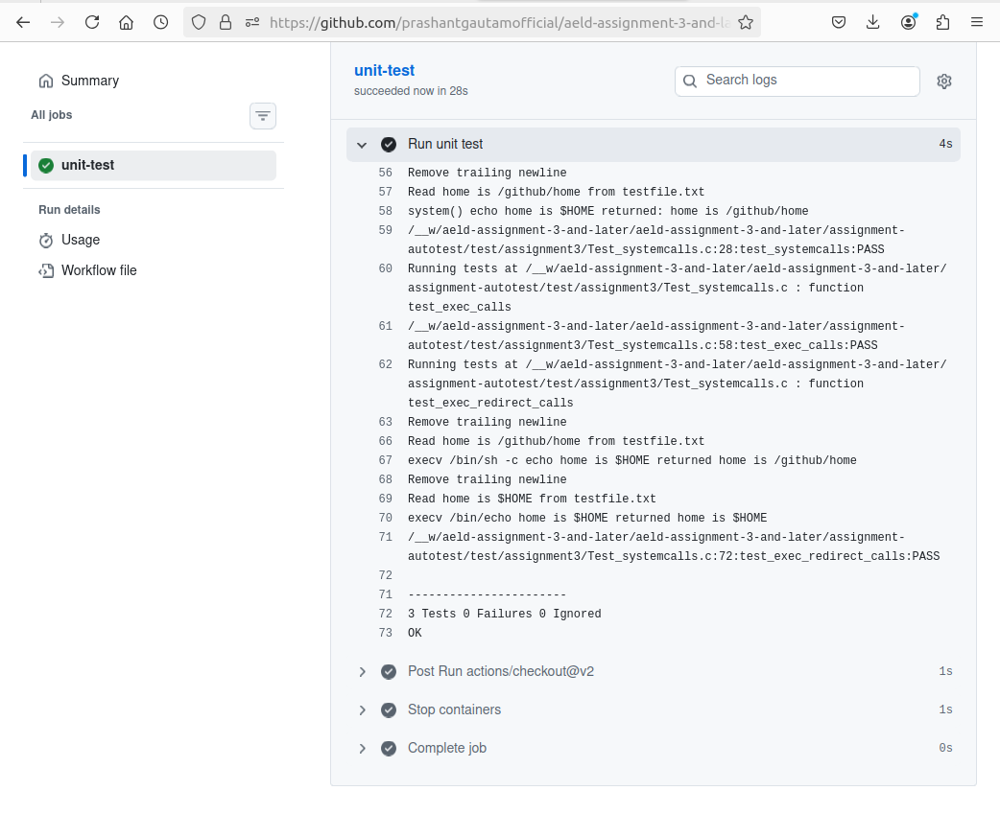

# AESD Assignment 3 Part 1: System Calls

## PART A: Use these commands in git bash to prepare your assignment repository:


```bash
git remote remove origin
git remote add assignments-base git@github.com:cu-ecen-aeld/aesd-assignments.git
git remote add origin git@github.com:prashantgautamofficial/aeld-assignment-3-and-later.git
git fetch assignments-
git merge assignments-base/assignment3-part-1
git submodule update --init --
git push origin main
```

## PART B: Implementation:

1. Modify your finder-app/finder-test.sh script to remove the make step.

1. You will add a cross-compile make step for this utilty in a different script as a part of Assignment 3 part 2.

1. Make modifications in the 
examples/systemcalls/systemcalls.c
 file to implement the TODO there related to video content and system() and exec() functions.  See provided test code in 
https://github.com/cu-ecen-aeld/assignment-autotest/blob/master/test/assignment3/Test_systemcalls.c
 which will verify your implementation.  Run ./unit-test.sh to test your implementation using unity unit tests.

1. Tag your repository assignment-3-part-1 using 
https://github.com/cu-ecen-aeld/aesd-assignments/wiki/Tagging-a-Release

### STEP 1 & 2

```bash
cd ~/Documents/aeld-assignment-3-and-later/
gedit finder-app/finder-test.sh
```

```bash
#!/bin/sh
# Tester script for assignment 1 and assignment 2
# Author: Siddhant Jajoo

set -e
set -u

NUMFILES=10
WRITESTR=AELD_IS_FUN
WRITEDIR=/tmp/aeld-data
username=$(cat conf/username.txt)

if [ $# -lt 3 ]
then
	echo "Using default value ${WRITESTR} for string to write"
	if [ $# -lt 1 ]
	then
		echo "Using default value ${NUMFILES} for number of files to write"
	else
		NUMFILES=$1
	fi	
else
	NUMFILES=$1
	WRITESTR=$2
	WRITEDIR=/tmp/aeld-data/$3
fi

MATCHSTR="The number of files are ${NUMFILES} and the number of matching lines are ${NUMFILES}"
echo "Writing ${NUMFILES} files containing string ${WRITESTR} to ${WRITEDIR}"

rm -rf "${WRITEDIR}"

# create $WRITEDIR if not assignment1
assignment=`cat ../conf/assignment.txt`

if [ $assignment != 'assignment1' ]
then
	mkdir -p "$WRITEDIR"
	#The WRITEDIR is in quotes because if the directory path consists of spaces, then variable substitution will consider it as multiple argument.
	#The quotes signify that the entire string in WRITEDIR is a single string.
	#This issue can also be resolved by using double square brackets i.e [[ ]] instead of using quotes.
	if [ -d "$WRITEDIR" ]
	then
		echo "$WRITEDIR created"
	else
		exit 1
	fi
fi

for i in $( seq 1 $NUMFILES)
do
	writer "$WRITEDIR/${username}$i.txt" "$WRITESTR"
done

OUTPUTSTRING=$(finder.sh "$WRITEDIR" "$WRITESTR")
echo "${OUTPUTSTRING}" > /tmp/assignment4-result.txt

# remove temporary directories
rm -rf /tmp/aeld-data

set +e
echo ${OUTPUTSTRING} | grep "${MATCHSTR}"
if [ $? -eq 0 ]; then
	echo "success"
	exit 0
else
	echo "failed: expected  ${MATCHSTR} in ${OUTPUTSTRING} but instead found"
	exit 1
fi
```

### STEP 3

```bash
cd ~/Documents/aeld-assignment-3-and-later/
gedit examples/systemcalls/systemcalls.c
```

```c
#include "systemcalls.h"
#include <sys/wait.h>
#include <unistd.h>
#include <stdlib.h>
#include <fcntl.h>

/**
 * @param cmd the command to execute with system()
 * @return true if the command in @param cmd was executed
 *   successfully using the system() call, false if an error occurred,
 *   either in invocation of the system() call, or if a non-zero return
 *   value was returned by the command issued in @param cmd.
*/
bool do_system(const char *cmd)
{

/*
 * TODO  add your code here
 *  Call the system() function with the command set in the cmd
 *   and return a boolean true if the system() call completed with success
 *   or false() if it returned a failure
*/
    int status = system(cmd);

    if (status == -1)
    {
        // system() itself failed to fork/exec a shell
        return false;
    }

    // system() returns the command's exit status encoded like waitpid() does,
    // so use WIFEXITED/WEXITSTATUS to check it actually exited normally with code 0
    if (WIFEXITED(status) && WEXITSTATUS(status) == 0)
    {
        return true;
    }

    return false;

    return true;
}

/**
* @param count -The numbers of variables passed to the function. The variables are command to execute.
*   followed by arguments to pass to the command
*   Since exec() does not perform path expansion, the command to execute needs
*   to be an absolute path.
* @param ... - A list of 1 or more arguments after the @param count argument.
*   The first is always the full path to the command to execute with execv()
*   The remaining arguments are a list of arguments to pass to the command in execv()
* @return true if the command @param ... with arguments @param arguments were executed successfully
*   using the execv() call, false if an error occurred, either in invocation of the
*   fork, waitpid, or execv() command, or if a non-zero return value was returned
*   by the command issued in @param arguments with the specified arguments.
*/

bool do_exec(int count, ...)
{
    va_list args;
    va_start(args, count);
    char * command[count+1];
    int i;
    for(i=0; i<count; i++)
    {
        command[i] = va_arg(args, char *);
    }
    command[count] = NULL;
    // this line is to avoid a compile warning before your implementation is complete
    // and may be removed
    command[count] = command[count];

/*
 * TODO:
 *   Execute a system command by calling fork, execv(),
 *   and wait instead of system (see LSP page 161).
 *   Use the command[0] as the full path to the command to execute
 *   (first argument to execv), and use the remaining arguments
 *   as second argument to the execv() command.
 *
*/

    fflush(stdout);

    pid_t pid = fork();

    if (pid == -1)
    {
        // fork failed
        va_end(args);
        return false;
    }
    else if (pid == 0)
    {
        // child process
        execv(command[0], command);

        // execv only returns if it failed
        exit(1);
    }
    else
    {
        // parent process
        int status;
        if (waitpid(pid, &status, 0) == -1)
        {
            va_end(args);
            return false;
        }

        if (WIFEXITED(status) && WEXITSTATUS(status) == 0)
        {
            va_end(args);
            return true;
        }

        va_end(args);
        return false;
    }

    va_end(args);

    return true;
}

/**
* @param outputfile - The full path to the file to write with command output.
*   This file will be closed at completion of the function call.
* All other parameters, see do_exec above
*/
bool do_exec_redirect(const char *outputfile, int count, ...)
{
    va_list args;
    va_start(args, count);
    char * command[count+1];
    int i;
    for(i=0; i<count; i++)
    {
        command[i] = va_arg(args, char *);
    }
    command[count] = NULL;
    // this line is to avoid a compile warning before your implementation is complete
    // and may be removed
    command[count] = command[count];


/*
 * TODO
 *   Call execv, but first using https://stackoverflow.com/a/13784315/1446624 as a refernce,
 *   redirect standard out to a file specified by outputfile.
 *   The rest of the behaviour is same as do_exec()
 *
*/
    fflush(stdout);

    pid_t pid = fork();

    if (pid == -1)
    {
        // fork failed
        va_end(args);
        return false;
    }
    else if (pid == 0)
    {
        // child process

        int fd = open(outputfile, O_WRONLY | O_CREAT | O_TRUNC, 0644);
        if (fd == -1)
        {
            exit(1);
        }

        if (dup2(fd, STDOUT_FILENO) == -1)
        {
            close(fd);
            exit(1);
        }

        close(fd);

        execv(command[0], command);

        // execv only returns if it failed
        exit(1);
    }
    else
    {
        // parent process
        int status;
        if (waitpid(pid, &status, 0) == -1)
        {
            va_end(args);
            return false;
        }

        if (WIFEXITED(status) && WEXITSTATUS(status) == 0)
        {
            va_end(args);
            return true;
        }

        va_end(args);
        return false;
    }

    va_end(args);

    return true;
}
```


```bash

git remote -v

git add -A

git commit -m "Assignment 3 Part 1: implement do_system, do_exec, do_exec_redirect in  
examples/systemcalls/systemcalls.c; remove make step from finder-test.sh"

git tag -a assignment-3-part-1 -m "Assignment 3 Part 1"

git branch

git push origin main

git push origin assignment-3-part-1

```



