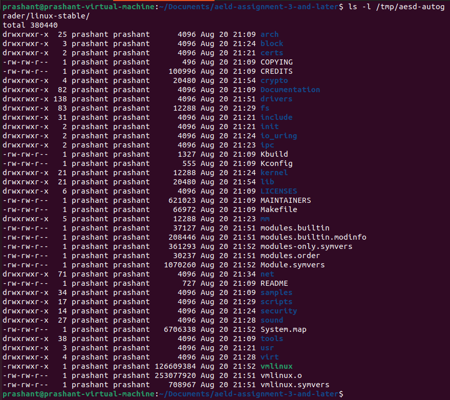
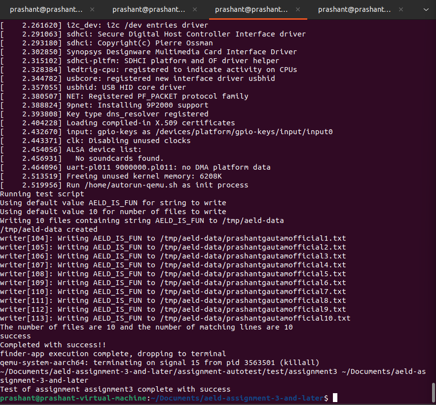
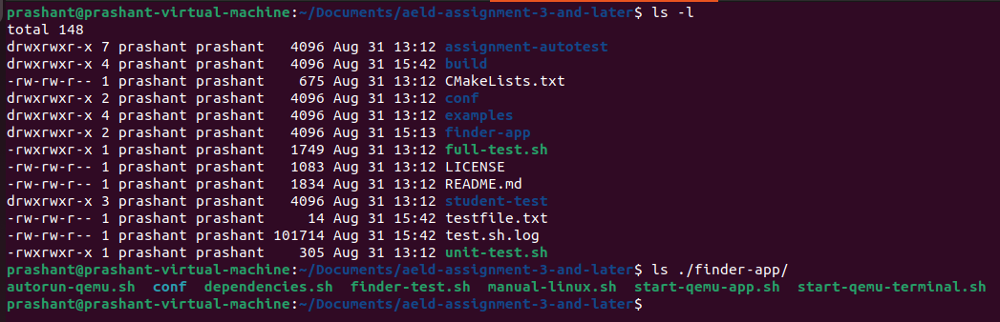
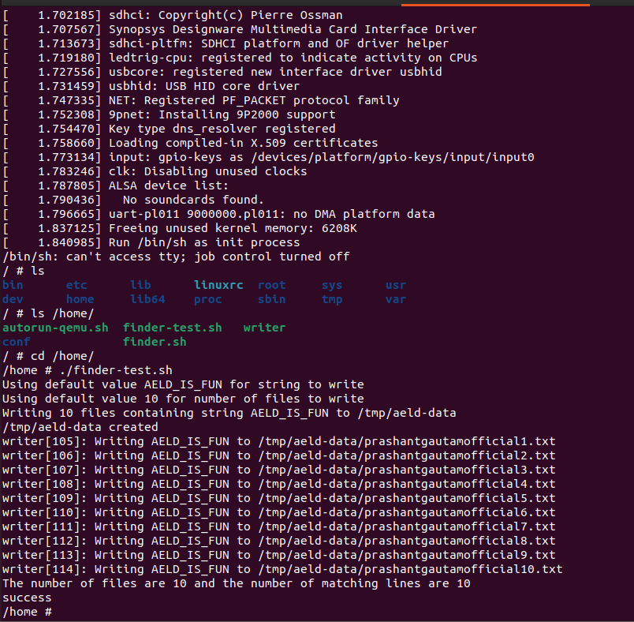

# Assignment 3 Part 2:  Manual Kernel and Root Filesystem Build 

## GitHub Repository Link 

Use the same repository as assignment-3-part-1.

## GitHub Repository Start Instructions

For this assignment, start with the git repo created for the previous assignment-3-part-1.  


### Use these commands in git bash to prepare your assignment repository: 

```bash
git merge assignments-base/assignment3-part-2
```

Merge the assignment 3 starter code from the assignment3 branch of the aes0d-assignments repository into your master branch 

```bash
git submodule update --init --recursive 
```

Update automated testing source 

```bash
git push origin main
```

This pushes your main branch, including previous assignment source and content merged from assignments-base to your working repository for this assignment.


## Update the `manual-linux.sh` inside finder-app directory

```bash
#!/bin/bash
# Script outline to install and build kernel.
# Author: Siddhant Jajoo.

set -e
set -u

OUTDIR=/tmp/aeld
KERNEL_REPO=https://git.kernel.org/pub/scm/linux/kernel/git/stable/linux-stable.git
KERNEL_VERSION=v5.15.163
BUSYBOX_VERSION=1_33_1
FINDER_APP_DIR=$(realpath $(dirname $0))
ARCH=arm64
CROSS_COMPILE=aarch64-none-linux-gnu-

if [ $# -lt 1 ]
then
	echo "Using default directory ${OUTDIR} for output"
else
	OUTDIR=$1
	echo "Using passed directory ${OUTDIR} for output"
fi

# Create outdir, fail if it can't be created
mkdir -p ${OUTDIR}
if [ ! -d "${OUTDIR}" ]
then
	echo "ERROR: could not create output directory ${OUTDIR}"
	exit 1
fi

cd "$OUTDIR"
if [ ! -d "${OUTDIR}/linux-stable" ]; then
    #Clone only if the repository does not exist.
	echo "CLONING GIT LINUX STABLE VERSION ${KERNEL_VERSION} IN ${OUTDIR}"
	CLONE_OK=0
	for attempt in 1 2 3; do
		echo "Kernel clone attempt ${attempt} of 3..."
		if git clone ${KERNEL_REPO} --depth 1 --single-branch --branch ${KERNEL_VERSION}; then
			CLONE_OK=1
			break
		fi
		echo "Kernel clone attempt ${attempt} failed, retrying in $((10 * attempt))s..."
		rm -rf "${OUTDIR}/linux-stable"
		sleep $((10 * attempt))
	done
	if [ "${CLONE_OK}" -ne 1 ]; then
		echo "ERROR: failed to clone kernel repo (${KERNEL_REPO}) after 3 attempts"
		exit 1
	fi
fi
if [ ! -e ${OUTDIR}/linux-stable/arch/${ARCH}/boot/Image ]; then
    cd linux-stable
    echo "Checking out version ${KERNEL_VERSION}"
    git checkout ${KERNEL_VERSION}

    # TODO: Add your kernel build steps here
    echo "Cleaning kernel build tree"
    make ARCH=${ARCH} CROSS_COMPILE=${CROSS_COMPILE} mrproper

    echo "Configuring kernel (defconfig)"
    make ARCH=${ARCH} CROSS_COMPILE=${CROSS_COMPILE} defconfig

    echo "Building kernel Image"
    make -j$(nproc) ARCH=${ARCH} CROSS_COMPILE=${CROSS_COMPILE} all

    # Skipping modules_install per assignment instructions (modules not needed,
    # and default-size modules won't fit initramfs at default QEMU memory).

    echo "Building device tree blobs"
    make -j$(nproc) ARCH=${ARCH} CROSS_COMPILE=${CROSS_COMPILE} dtbs
fi

echo "Adding the Image in outdir"
cp -v ${OUTDIR}/linux-stable/arch/${ARCH}/boot/Image ${OUTDIR}/Image

echo "Creating the staging directory for the root filesystem"
cd "$OUTDIR"
if [ -d "${OUTDIR}/rootfs" ]
then
	echo "Deleting rootfs directory at ${OUTDIR}/rootfs and starting over"
    sudo rm  -rf ${OUTDIR}/rootfs
fi

# TODO: Create necessary base directories
mkdir -p ${OUTDIR}/rootfs
cd ${OUTDIR}/rootfs
mkdir -p bin dev etc home lib lib64 proc sbin sys tmp usr var
mkdir -p usr/bin usr/lib usr/sbin
mkdir -p var/log

cd "$OUTDIR"
if [ ! -d "${OUTDIR}/busybox" ]
then
	BUSYBOX_CLONE_OK=0
	BUSYBOX_PRIMARY_REPO=https://git.busybox.net/busybox
	BUSYBOX_MIRROR_REPO=https://github.com/mirror/busybox

	for attempt in 1 2 3; do
		echo "Busybox clone attempt ${attempt} of 3 (primary: ${BUSYBOX_PRIMARY_REPO})..."
		if git clone --depth 1 --branch ${BUSYBOX_VERSION} ${BUSYBOX_PRIMARY_REPO}; then
			BUSYBOX_CLONE_OK=1
			break
		fi
		echo "Busybox clone attempt ${attempt} failed, retrying in $((10 * attempt))s..."
		rm -rf "${OUTDIR}/busybox"
		sleep $((10 * attempt))
	done

	if [ "${BUSYBOX_CLONE_OK}" -ne 1 ]; then
		echo "Primary busybox repo unavailable after 3 attempts, trying GitHub mirror (${BUSYBOX_MIRROR_REPO})..."
		if git clone --depth 1 --branch ${BUSYBOX_VERSION} ${BUSYBOX_MIRROR_REPO} busybox; then
			BUSYBOX_CLONE_OK=1
		fi
	fi

	if [ "${BUSYBOX_CLONE_OK}" -ne 1 ]; then
		echo "ERROR: failed to clone busybox repo from both primary and mirror sources"
		exit 1
	fi
    cd busybox
    # Already checked out at ${BUSYBOX_VERSION} via --branch above (shallow clone).
    # TODO:  Configure busybox
    # Force fully non-interactive config: pass ARCH so defconfig resolves correctly,
    # and pipe empty input so any stray prompt (e.g. from a stale .config) defaults
    # through instead of hanging the CI job waiting on stdin.
    make ARCH=${ARCH} distclean
    yes "" | make ARCH=${ARCH} defconfig
else
    cd busybox
    # Directory already existed (e.g. persistent CI container from a prior run).
    # Re-force a clean, non-interactive config so stale state can't cause the
    # build to hang waiting on interactive prompts.
    make ARCH=${ARCH} distclean
    yes "" | make ARCH=${ARCH} defconfig
fi

# TODO: Make and install busybox
echo "Building busybox..."
make ARCH=${ARCH} CROSS_COMPILE=${CROSS_COMPILE} 2>&1 | tee /tmp/busybox_build.log

if [ ! -f "busybox" ]; then
	echo "ERROR: busybox binary was not produced by the build step."
	echo "Last 50 lines of build output:"
	tail -50 /tmp/busybox_build.log
	exit 1
fi
echo "busybox binary built successfully: $(ls -la busybox)"

make CONFIG_PREFIX=${OUTDIR}/rootfs ARCH=${ARCH} CROSS_COMPILE=${CROSS_COMPILE} install

echo "Library dependencies"
${CROSS_COMPILE}readelf -a busybox | grep "program interpreter"
${CROSS_COMPILE}readelf -a busybox | grep "Shared library"

# TODO: Add library dependencies to rootfs
SYSROOT=$(${CROSS_COMPILE}gcc -print-sysroot)
echo "Toolchain sysroot: ${SYSROOT}"

cp -va ${SYSROOT}/lib/ld-linux-aarch64.so.1 ${OUTDIR}/rootfs/lib/
cp -va ${SYSROOT}/lib64/ld-linux-aarch64.so.1 ${OUTDIR}/rootfs/lib64/ 2>/dev/null || true

cp -va ${SYSROOT}/lib64/libm.so.6 ${OUTDIR}/rootfs/lib64/
cp -va ${SYSROOT}/lib64/libresolv.so.2 ${OUTDIR}/rootfs/lib64/
cp -va ${SYSROOT}/lib64/libc.so.6 ${OUTDIR}/rootfs/lib64/

# TODO: Make device nodes
cd ${OUTDIR}/rootfs
sudo mknod -m 666 dev/null c 1 3
sudo mknod -m 600 dev/console c 5 1

# TODO: Clean and build the writer utility
cd ${FINDER_APP_DIR}
make clean
make CROSS_COMPILE=${CROSS_COMPILE}

# TODO: Copy the finder related scripts and executables to the /home directory
# on the target rootfs
cp -v ${FINDER_APP_DIR}/writer ${OUTDIR}/rootfs/home/
cp -v ${FINDER_APP_DIR}/finder.sh ${OUTDIR}/rootfs/home/
cp -v ${FINDER_APP_DIR}/finder-test.sh ${OUTDIR}/rootfs/home/
mkdir -p ${OUTDIR}/rootfs/home/conf
cp -v ${FINDER_APP_DIR}/conf/username.txt ${OUTDIR}/rootfs/home/conf/
cp -v ${FINDER_APP_DIR}/conf/assignment.txt ${OUTDIR}/rootfs/home/conf/

# Modify finder-test.sh to reference conf/assignment.txt instead of ../conf/assignment.txt
sed -i 's|\.\./conf/assignment\.txt|conf/assignment.txt|g' ${OUTDIR}/rootfs/home/finder-test.sh

# TODO: Copy the autorun-qemu.sh script into the outdir/rootfs/home directory
cp -v ${FINDER_APP_DIR}/autorun-qemu.sh ${OUTDIR}/rootfs/home/

# TODO: Chown the root directory
sudo chown -R root:root ${OUTDIR}/rootfs

# TODO: Create initramfs.cpio.gz
cd ${OUTDIR}/rootfs
find . | cpio -H newc -ov --owner root:root > ${OUTDIR}/initramfs.cpio
cd "$OUTDIR"
gzip -f initramfs.cpio

echo "Build complete. Kernel Image and initramfs.cpio.gz are in ${OUTDIR}"
```

## Run the full test

```bash
cd ~/Documents/aeld-assignment-3-and-later
./full-test.sh
```

* This will start building the kernel inside temp directory

```bash
ls -l /tmp/aesd-autograder/linux-stable/
```



## Verify the test

* After the above step os complete, rerun the full-test

```bash
SKIP_BUILD=1 DO_VALIDATE=1 ./full-test.sh
```




## Verify the QEMU installation

```bash
cd ~/Documents/aeld-assignment-3-and-later
ls ./finder-app/
```




```bash
./start-qemu-terminal.sh /tmp/aesd-autograder/
```



```bash
cd ~/Documents/aeld-assignment-3-and-later

# confirm your default branch name before pushing
git branch

# see what's about to be committed
git status

# stage and commit
git add -A
git commit -m "Assignment 3 Part 2: Manual Kernel and Root Filesystem Build Successfull"

# push the branch
git push origin main        # use master if that's what `git branch` showed

# tag and push the tag separately
git tag -a assignment-3-part-2 -m "Assignment 3 Part 2"
git push origin assignment-3-part-2
```