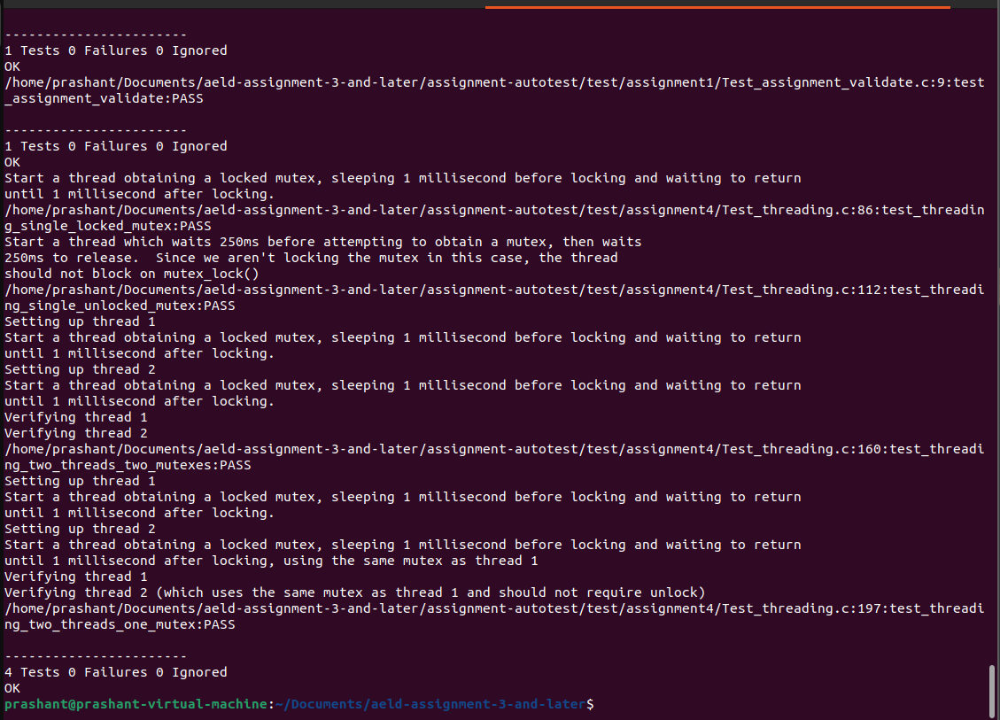
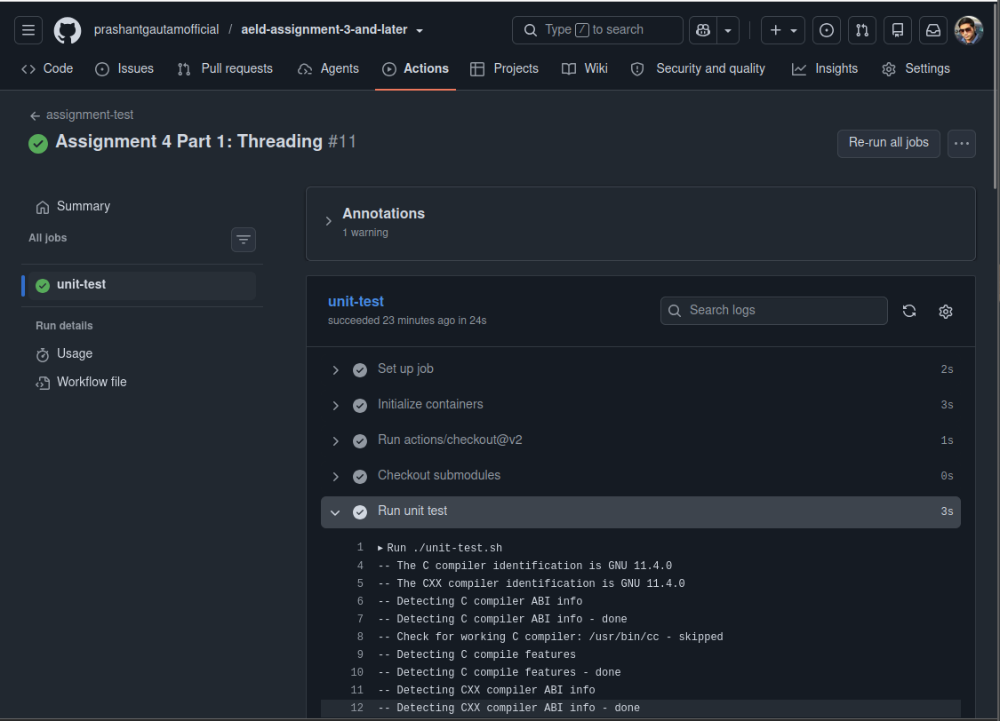
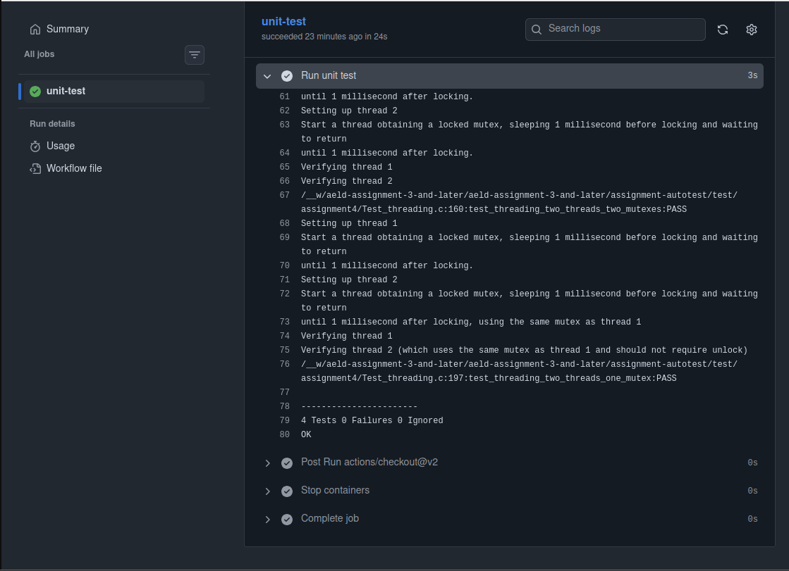

# Assignment 4 Part 1: Threading

## GitHub Repository Start Instructions

Your assignment 3 repository will contain source code used in previous assignments, which will ultimately be placed in your embedded images built using buildroot and yocto in later assignments.  With this assignment, you will add some threading related test code implementation to your assignment 3 repository.  To pull in this code you’ll need to start by merging in the latest content from assignments-base, including new test content.  From your assignment 3 repository:

```bash
git fetch assignments-base
```

Fetch the latest content from the starter code remote added during previous assignments

This step assumes you’ve already created the remote using:

```bash
git remote add assignments-base git@github.com:cu-ecen-aeld/aesd-assignments.git
```

in assignment 2.  If you started from a new repo you’ll need to re-run the git remote-add step before attempting to fetch.

```bash
git merge assignments-base/assignment4
```

Merge the assignment 4 starter code from the assignment4 branch of the aesd-assignments repository into your main branch

```bash
git submodule update --init --recursive
```

Update automated testing source

```bash
git push origin main
```

This pushes your main branch, including previous assignment source and content merged from assignments-base to your working repository for this assignment.


## Implementation:

Make modifications in the examples/threading/threading.c
file to implement the TODO there related to lecture content and  start_thread_obtaining_mutex() as described in:

examples/threading/threading.h

.  See provided test code in 
https://github.com/cu-ecen-aeld/assignment-autotest/blob/master/test/assignment4/Test_threading.c
 
which will verify your implementation.  Run 

```bash
./unit-test.sh
```


to test your implementation using unity unit tests.



Tag your repository assignment-4-part-1 using:

https://github.com/cu-ecen-aeld/aesd-assignments/wiki/Tagging-a-Release


```bash
git status

git add -A

git status

git commit -m "Assignment 4 Part 1: Threading"

git push origin main

git tag -a assignment-4-part-1 -m "Assignment 4 Part 1"

git push origin assignment-4-part-1
```





[GitHub Actions Run](https://github.com/prashantgautamofficial/aeld-assignment-3-and-later/actions/runs/33482421808/job/99774800194)
