# Assignment 4: Buildroot Environment Bring-Up — Step-by-Step Guide

This walks through the entire assignment end-to-end: repo setup, submodules, package
creation, defconfig capture, build, QEMU boot, SSH/dropbear, and final submission. Follow
it top to bottom; each step notes which repo (Assignment 4 "buildroot" repo vs.
Assignment 3/`assignments-3-and-later` "source" repo) it applies to.

---

## 0. Prerequisites (host machine)

Install the Buildroot **mandatory** host packages (from the Buildroot manual, System
Requirements section) plus the extras this course's autotest environment uses:

```bash
sudo apt-get update && sudo apt-get install -y \
  sed make binutils build-essential diffutils gcc g++ bash patch gzip bzip2 \
  perl tar cpio unzip rsync file bc findutils wget python3 \
  libncurses-dev git qemu-system-arm \
  openssh-client expect sshpass psmisc netcat-openbsd iputils-ping \
  dialog libssl-dev
```

```bash
sudo apt-get update && sudo apt-get install -y findutils openssh-client psmisc libncurses5-dev libssl-dev
```

Verify the mandatory ones are actually present (Buildroot checks these at configure
time):


```bash
for cmd in sed make ar gcc g++ bash patch gzip bzip2 perl tar cpio unzip rsync file bc find wget python3 git qemu-system-arm ssh expect sshpass killall nc ping dialog; do
    which "$cmd" >/dev/null 2>&1 && echo "OK      $cmd" || echo "MISSING $cmd"
done

# Check for the development libraries using dpkg-query
for pkg in libncurses5-dev libncurses-dev libssl-dev; do
    dpkg-query -W -f='${Status}' "$pkg" 2>/dev/null | grep -q "ok installed" && echo "OK      package: $pkg" || echo "NOT-INSTALLED package: $pkg"
done
```


`sshpass` is required later for `full-test.sh`; `qemu-system-arm` is required to boot the
aarch64 virt image with `qemu-system-aarch64` (comes from the same package on Debian/Ubuntu).

---

## 1. Create the Assignment 4 repository


1. Open the GitHub Classroom link from the course "GitHub Classroom Links" page and
   accept the assignment. This creates an **empty** repo for you
   (`assignment-4-<username>`).
   https://github.com/new?name=aeld-assignment-4&description=Coursera%20AELD%20Assignment&visibility=public
2. If GitHub Classroom fails to create/populate it, follow the manual workaround at
   the course wiki page linked in the assignment
   (`Workaround-for-issues-with-github-classroom`).
3. Clone it locally:

```bash
git clone git@github.com:prashantgautamofficial/aeld-assignment-4.git
```

Do **not** reuse your Assignment 3 repo's content/history here — this is a fresh repo.

---

## 2. Pull in the buildroot-assignments-base starter code

Per the assignment instructions, do **not** use the GitHub "add a README" flow. Instead
merge the base template in directly:

```bash
git remote add buildroot-assignments-base https://github.com/cu-ecen-aeld/buildroot-assignments-base.git
git fetch buildroot-assignments-base
git merge buildroot-assignments-base/master --allow-unrelated-histories
```

> Add `--allow-unrelated-histories` if your empty repo's initial commit has no shared
> history with the base repo (Git will tell you if it's needed).

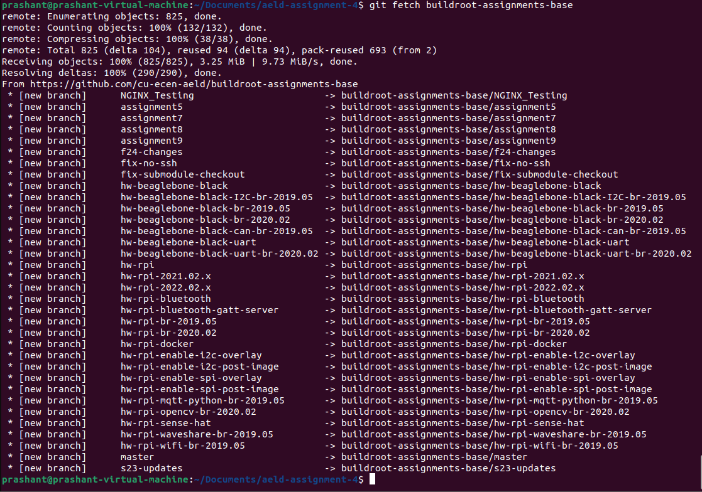


You should now see, at the repo root:

```
base_external/
build.sh
save-config.sh
runqemu.sh
shared.sh
README.md
.gitmodules (may reference assignment-autotest already)
```

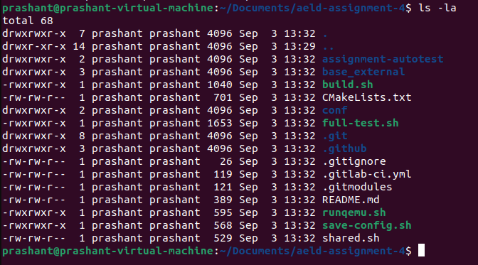

Initialize submodules that came with the base repo (this pulls the
`assignment-autotest` nested repo used for automated grading):

```bash
git submodule update --init --recursive
```
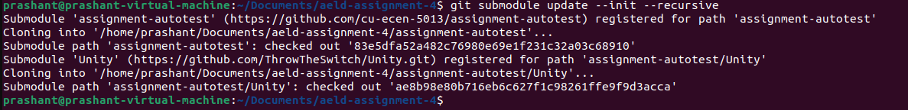

Commit the merge:

```bash
git branch
git branch -m main master
git add -A
git commit -m "Merge buildroot-assignments-base starter code"
git push origin master
```

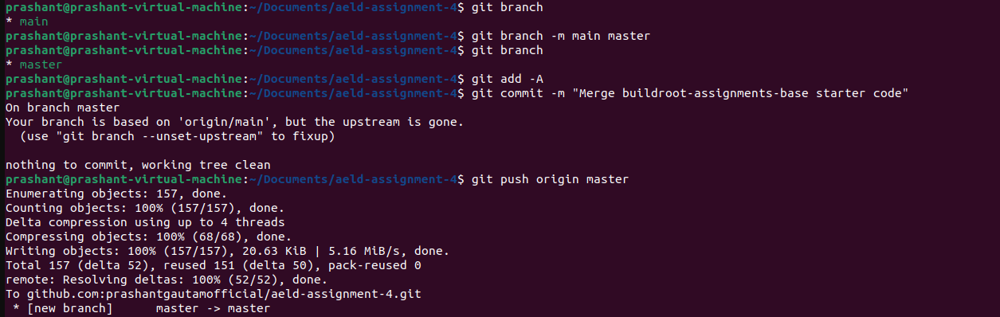

---

## 3. Add Buildroot itself as a submodule

Add the official Buildroot GitLab mirror, pinned to the `2024.02.13` branch, as a
submodule at the repo root:


```bash
git submodule add https://gitlab.com/buildroot.org/buildroot.git buildroot
```

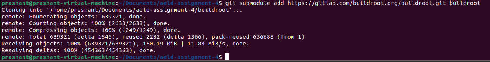

```bash
cd buildroot
git fetch origin 2024.02.13
git checkout 2024.02.13
cd ..
```

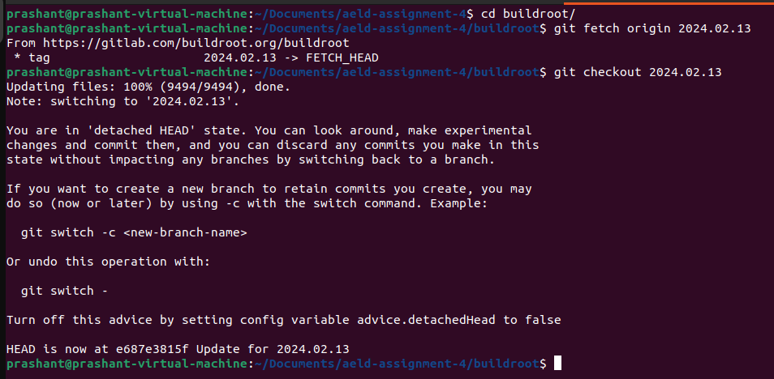

This clones `buildroot/` and creates/updates `.gitmodules` with a `buildroot` entry
tracking branch `2024.02.13`.

Verify you actually landed on a 2024.02.13 commit:

```bash
cd buildroot
head -5 CHANGES        

# first entry should say something like this:

# 2024.02.13, released April 22nd, 2025

#	Important / security related fixes:

#	- xserver_xorg-server & xwayland: CVE-2024-9632, CVE-2025-26594,

git branch -a
git log -1 --oneline
cd ..
```
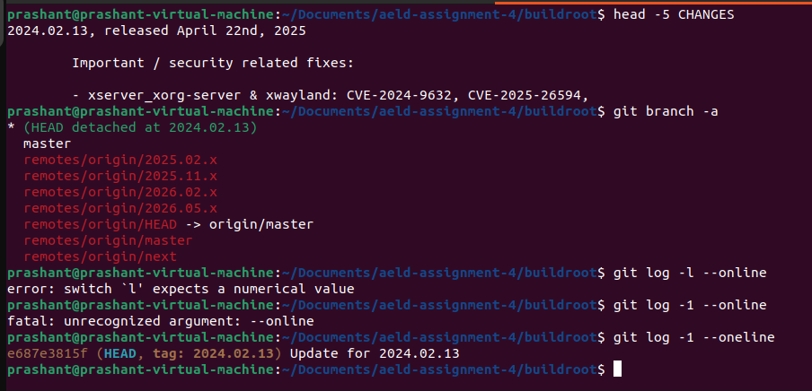

**Commit the submodule now**, before running `./build.sh` for the first time — the
instructions are explicit about this because it locks in the exact commit hash that CI
will check out later:

```bash
git config -f .gitmodules submodule.buildroot.branch 2024.02.13
git add .gitmodules buildroot
git commit -m "Add buildroot submodule pinned to 2024.02.13"
git push origin master
```

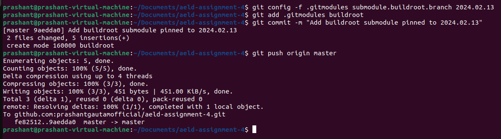

---

## 4. First build — generate the default `.config`

From the repo root:

```bash
./build.sh
```

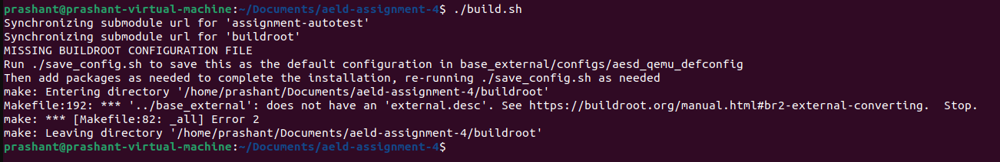

```bash
./save-config.sh
```

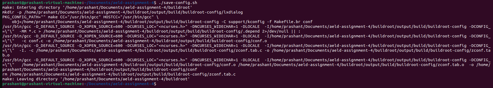

### MISSING BUILDROOT CONFIGURATION FILE - FIX


```bash
ls buildroot/Makefile   # should exist — if not, submodule isn't checked out

# generate a default config if buildroot/.config doesn't exist
cd buildroot
make qemu_aarch64_virt_defconfig
cd ..

# now save it into your tracked defconfig
./save-config.sh

# confirm it now exists
ls -la base_external/configs/aesd_qemu_defconfig
cat base_external/configs/aesd_qemu_defconfig | head
```


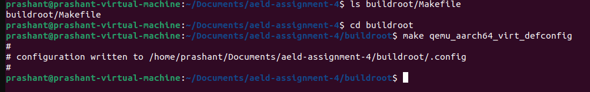

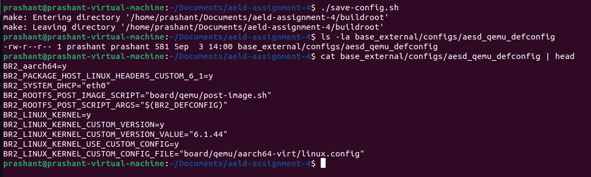


On a fresh checkout with no `buildroot/.config`, `build.sh` (from the base repo) will
default to `qemu_aarch64_virt_defconfig` and run `make qemu_aarch64_virt_defconfig`,
then start a build. **You only need the configuration step to succeed the first time
through** — but it's fine to let it run; a full build here will download toolchain/
package sources into `buildroot/dl` unless you've set `BR2_DL_DIR` (see the speedup
section below). If you just want the defconfig without waiting hours, you can
Ctrl-C after you see the `.config` populated in `buildroot/.config`, or add the
speedup settings first (§10) so subsequent full builds are fast.

Confirm the config landed:

```bash
grep -E "BR2_aarch64|BR2_TARGET_GENERIC_HOSTNAME|BR2_arm" buildroot/.config | head
```

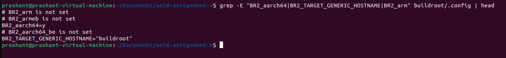

---

## 5. Save the defconfig into your project

Run the helper script from the repo root:

```bash
./save-config.sh
```

This runs `make savedefconfig` inside `buildroot/` and copies the resulting minimal
defconfig out to `base_external/configs/aesd_qemu_defconfig`. Confirm it changed:

```bash
git diff base_external/configs/aesd_qemu_defconfig
```

At this point it should just mirror `qemu_aarch64_virt_defconfig` (plus whatever
`BR2_EXTERNAL`/download-dir settings `build.sh` injects). Commit:

```bash
git add base_external/configs/aesd_qemu_defconfig
git commit -m "Save initial aesd_qemu_defconfig"
git push origin master
```

---

## 6. Update your Assignment 3 (`assignments-3-and-later`) repo first

The `aesd-assignments` Buildroot package builds your finder app **from your source
repo over git**, so the source-repo changes need to exist (and be pushed) before the
package can clone/build them.

In your `assignments-3-and-later-<username>` repo:

### 6a. Make `finder-test.sh` PATH- and `/etc`-friendly

Currently (from earlier assignments) your `finder-test.sh` likely does things like
`./writer`, `./finder.sh`, and reads `conf/username.txt` relative to the script's own
directory. On the target rootfs none of that layout exists — everything lands flat in
`/usr/bin` and `/etc/finder-app/conf`. Update it so it:

- Calls `writer`, `finder.sh`, etc. **without** a `./` prefix, relying on `$PATH`
  (buildroot will install these into `/usr/bin`, which is on `PATH` for the root user).
- Reads configuration (`username.txt`, `assignment.txt`) from `/etc/finder-app/conf/`
  instead of a path relative to the script.
- Can be invoked from any working directory, e.g. `cd / && finder-test.sh` should work.
- Writes the numbered-files/matches summary produced by the finder command to
  `/tmp/assignment4-result.txt`.

A typical diff looks like:

#### Original ####

```bash
#!/bin/sh
# Tester script for assignment 1 and assignment 2
# Author: Siddhant Jajoo

set -e
set -u

NUMFILES=10
WRITESTR=AELD_IS_FUN
WRITEDIR=/tmp/aeld-data
username=$(cat conf/username.txt)

if [ $# -lt 3 ]
then
	echo "Using default value ${WRITESTR} for string to write"
	if [ $# -lt 1 ]
	then
		echo "Using default value ${NUMFILES} for number of files to write"
	else
		NUMFILES=$1
	fi
else
	NUMFILES=$1
	WRITESTR=$2
	WRITEDIR=/tmp/aeld-data/$3
fi

MATCHSTR="The number of files are ${NUMFILES} and the number of matching lines are ${NUMFILES}"
echo "Writing ${NUMFILES} files containing string ${WRITESTR} to ${WRITEDIR}"

rm -rf "${WRITEDIR}"

# create $WRITEDIR if not assignment1
assignment=`cat ../conf/assignment.txt`

if [ $assignment != 'assignment1' ]
then
	mkdir -p "$WRITEDIR"
	#The WRITEDIR is in quotes because if the directory path consists of spaces, then variable substitution will consider it as multiple argument.
	#The quotes signify that the entire string in WRITEDIR is a single string.
	#This issue can also be resolved by using double square brackets i.e [[ ]] instead of using quotes.
	if [ -d "$WRITEDIR" ]
	then
		echo "$WRITEDIR created"
	else
		exit 1
	fi
fi

for i in $( seq 1 $NUMFILES)
do
	./writer "$WRITEDIR/${username}$i.txt" "$WRITESTR"
done

OUTPUTSTRING=$(./finder.sh "$WRITEDIR" "$WRITESTR")
echo "${OUTPUTSTRING}" > /tmp/assignment4-result.txt

# remove temporary directories
rm -rf /tmp/aeld-data

set +e
echo ${OUTPUTSTRING} | grep "${MATCHSTR}"
if [ $? -eq 0 ]; then
	echo "success"
	exit 0
else
	echo "failed: expected  ${MATCHSTR} in ${OUTPUTSTRING} but instead found"
	exit 1
fi
```

#### Modified ####

```bash
#!/bin/sh
# Tester script for assignment 1 and assignment 2
# Author: Siddhant Jajoo

set -e
set -u

NUMFILES=10
WRITESTR=AELD_IS_FUN
WRITEDIR=/tmp/aeld-data
username=$(cat /etc/finder-app/conf/username.txt)

if [ $# -lt 3 ]
then
	echo "Using default value ${WRITESTR} for string to write"
	if [ $# -lt 1 ]
	then
		echo "Using default value ${NUMFILES} for number of files to write"
	else
		NUMFILES=$1
	fi	
else
	NUMFILES=$1
	WRITESTR=$2
	WRITEDIR=/tmp/aeld-data/$3
fi

MATCHSTR="The number of files are ${NUMFILES} and the number of matching lines are ${NUMFILES}"
echo "Writing ${NUMFILES} files containing string ${WRITESTR} to ${WRITEDIR}"

rm -rf "${WRITEDIR}"

# create $WRITEDIR if not assignment1
assignment=`cat /etc/finder-app/conf/assignment.txt`

if [ $assignment != 'assignment1' ]
then
	mkdir -p "$WRITEDIR"
	#The WRITEDIR is in quotes because if the directory path consists of spaces, then variable substitution will consider it as multiple argument.
	#The quotes signify that the entire string in WRITEDIR is a single string.
	#This issue can also be resolved by using double square brackets i.e [[ ]] instead of using quotes.
	if [ -d "$WRITEDIR" ]
	then
		echo "$WRITEDIR created"
	else
		exit 1
	fi
fi

#echo "Removing the old writer utility and compiling as a native application"
#make clean
#make

for i in $( seq 1 $NUMFILES)
do
	writer "$WRITEDIR/${username}$i.txt" "$WRITESTR"
done

OUTPUTSTRING=$(finder.sh "$WRITEDIR" "$WRITESTR")
echo "${OUTPUTSTRING}" > /tmp/assignment4-result.txt

# remove temporary directories
rm -rf /tmp/aeld-data

set +e
echo ${OUTPUTSTRING} | grep "${MATCHSTR}"
if [ $? -eq 0 ]; then
	echo "success"
	exit 0
else
	echo "failed: expected  ${MATCHSTR} in ${OUTPUTSTRING} but instead found"
	exit 1
fi
```

Adjust variable names to match your actual script — the key requirements are:
**no relative paths to executables**, **config read from `/etc/finder-app/conf`**, and
**result redirected to `/tmp/assignment4-result.txt`**.


### 6b. Make sure `writer` cross-compiles via the `CC` variable

Buildroot's package infrastructure invokes your Makefile with `CC` set to the target
cross-compiler (e.g. `aarch64-buildroot-linux-gnu-gcc`) and typically
`CROSS_COMPILE` as well. Your `writer` Makefile from Assignment 2/3 must **respect
`CC` rather than hardcoding `gcc`**:

```bash
cd finder-app/
gedit Makefile
```

```makefile
# Makefile for the "writer" application (finder-app)
#
# Usage:
#   Native build:
#       make
#     or
#       make all
#
#   Cross-compile build (e.g. for aarch64 target):
#       make CROSS_COMPILE=aarch64-none-linux-gnu-
#
#   Clean build artifacts:
#       make clean
#
# CROSS_COMPILE is empty by default, which causes CC to resolve to the
# native "gcc". When CROSS_COMPILE is set on the command line, CC
# becomes e.g. "aarch64-none-linux-gnu-gcc", selecting the cross
# compiler installed in the toolchain.

CROSS_COMPILE ?=
CC := $(CROSS_COMPILE)gcc

CFLAGS ?= -Wall -Wextra -g -O0
LDFLAGS ?=

TARGET := writer
SRCS := writer.c
OBJS := $(SRCS:.c=.o)

.PHONY: all clean

all: $(TARGET)

$(TARGET): $(OBJS)
	$(CC) $(CFLAGS) $(OBJS) -o $(TARGET) $(LDFLAGS)

%.o: %.c
	$(CC) $(CFLAGS) -c $< -o $@

clean:
	rm -f $(TARGET) $(OBJS)
```

Do **not** hardcode a path to an ARM toolchain and do **not** check the compiled
`writer` binary into git — Buildroot cross-compiles it fresh each build.


### 6c. Commit and push

```bash
git add finder-app/finder-test.sh finder-app/Makefile   # or wherever these live
git commit -m "Assignment 4: PATH-friendly finder-test.sh, honor CC in writer Makefile"
git push origin main
```

```bash
# Get Commit Hash
git log -1 --format="%H"
```

```
a61c05f6b49d3253b2ecea1107d63004cf10e9c5
```

Note the **SSH clone URL** for this repo (you'll need it in the next step),


## 7. Create `external.desc` , `external.mk` and `Config.in` inside `base_external` directory

### 7a. `base_external/external.desc`

```bash
cat > base_external/external.desc << 'EOF'
name: project_base
desc: AESD assignment external buildroot tree
EOF
```

`project_base` is the external name required by the assignment.

### 7b. `base_external/external.mk`

```bash
cat > base_external/external.mk << 'EOF'
include $(sort $(wildcard $(BR2_EXTERNAL_project_base_PATH)/package/*/*.mk))
EOF
```

(The variable prefix `BR2_EXTERNAL_<NAME>_PATH` is auto-derived by Buildroot from the
`name:` field in `external.desc`, uppercased — `project_base` → `PROJECT_BASE`.)

### 7c. `base_external/Config.in`

```bash
cat > base_external/Config.in << 'EOF'
source "$BR2_EXTERNAL_project_base_PATH/package/aesd-assignments/Config.in"
EOF
```

### 7d. `base_external/package/aesd-assignments/Config.in`

```
config BR2_PACKAGE_AESD_ASSIGNMENTS
	bool "aesd-assignments"
	help
	  Builds and installs the AESD finder application (writer, finder.sh,
	  finder-test.sh) from the assignments-3-and-later git repository.
```


### 7e. `base_external/package/aesd-assignments/aesd-assignments.mk`

This is the core generic-package makefile. Use the **git site method** with the
**SSH URL** (not https) so the CI runner's deploy key can authenticate:

```make
################################################################################
#
# aesd-assignments
#
################################################################################

AESD_ASSIGNMENTS_VERSION = a61c05f6b49d3253b2ecea1107d63004cf10e9c5
AESD_ASSIGNMENTS_SITE = git@github.com:prashantgautamofficial/aeld-assignment-3-and-later.git
AESD_ASSIGNMENTS_SITE_METHOD = git
AESD_ASSIGNMENTS_GIT_SUBMODULES = YES

define AESD_ASSIGNMENTS_BUILD_CMDS
	$(MAKE) CC="$(TARGET_CC)" LDFLAGS="$(TARGET_LDFLAGS)" -C $(@D)/finder-app all
endef

define AESD_ASSIGNMENTS_INSTALL_TARGET_CMDS
	$(INSTALL) -d 0755 $(TARGET_DIR)/usr/bin
    $(INSTALL) -d 0755 $(@D)/conf/ $(TARGET_DIR)/etc/finder-app/conf/
	$(INSTALL) -m 0755 $(@D)/conf/* $(TARGET_DIR)/etc/finder-app/conf/
	$(INSTALL) -m 0755 $(@D)/finder-app/writer $(TARGET_DIR)/usr/bin/writer
	$(INSTALL) -m 0755 $(@D)/finder-app/finder.sh $(TARGET_DIR)/usr/bin/finder.sh
	$(INSTALL) -m 0755 $(@D)/finder-app/finder-test.sh $(TARGET_DIR)/usr/bin/finder-test.sh
	$(INSTALL) -m 0755 $(@D)/assignment-autotest/test/assignment4/* $(TARGET_DIR)/bin/	
endef

$(eval $(generic-package))
```

Adjust paths (`finder-app/`, `conf/`) to match your actual Assignment 3 repo layout.
Key points, straight from the assignment text and the generic-package tutorial:

- `AESD_ASSIGNMENTS_VERSION` must be an actual commit hash that exists in the remote
  repo (not a branch name) — this is what CI checks out, and it's also the #1 cause of
  the "submodule/package clone fails in Actions" error described in the assignment's
  troubleshooting section if it's wrong or unpushed.
- `AESD_ASSIGNMENTS_SITE` **must be the SSH form** (`git@github.com:...`), because the
  build machine (and later, the GitHub Actions runner) authenticates via an SSH deploy
  key, not a password — see §11 for wiring that up.
- Never hardcode a cross-toolchain path — `$(TARGET_CC)` is supplied by Buildroot and
  resolves to the correct `aarch64-buildroot-linux-gnu-gcc`.
- Do not `git add` the compiled `writer` binary anywhere in either repo.
- Remember to carefully use `-d` when installing a directory and `-m` for files.


---

## 8. Select the package in Buildroot's config

```bash
cd buildroot
make menuconfig
```

Navigate: `External options` → `aesd-assignments` (checkbox), or if the base repo
nested it under a different submenu, use `/` inside `menuconfig` to search for
`AESD_ASSIGNMENTS` and jump to it. Press `Y` to enable, then `Esc Esc` to exit and save.

```bash
cd ..
```

Save this selection back into your tracked defconfig:

```bash
./save-config.sh
git diff base_external/configs/aesd_qemu_defconfig
```

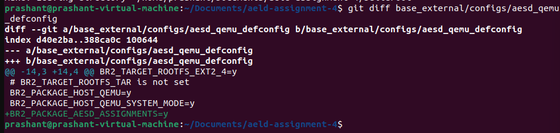

You should now see a new line such as `BR2_PACKAGE_AESD_ASSIGNMENTS=y` added. Commit:

```bash
git add base_external/configs/aesd_qemu_defconfig
git commit -m "Enable aesd-assignments package in defconfig"
git push origin master
```

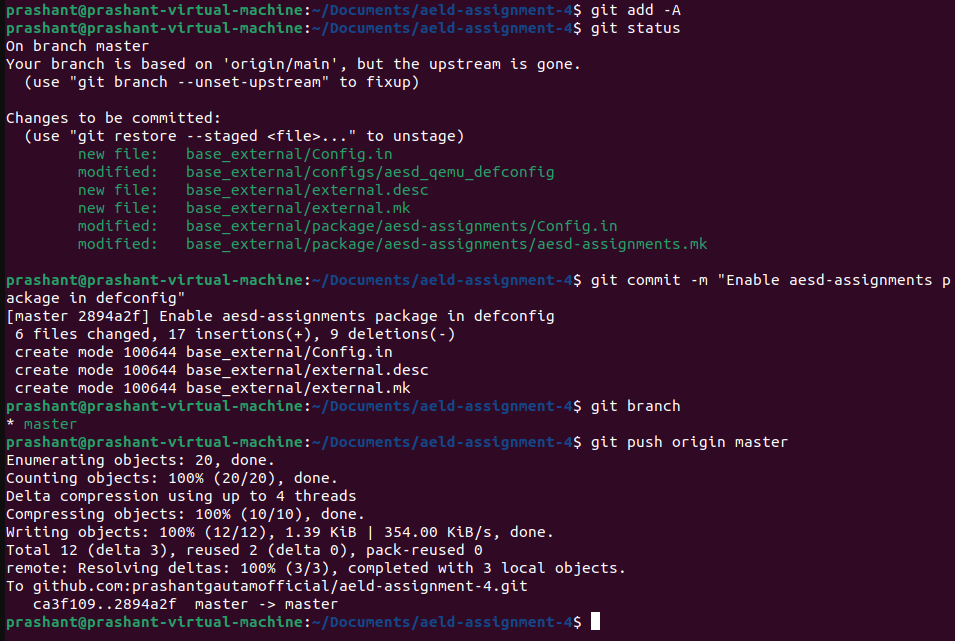

---

## 9. Add `clean.sh`

At the repo root:

```bash
cat > clean.sh << 'EOF'
#!/bin/bash
set -e
SCRIPT_DIR=$(dirname "$(readlink -f "$0")")
make -C "${SCRIPT_DIR}/buildroot" distclean
EOF
```

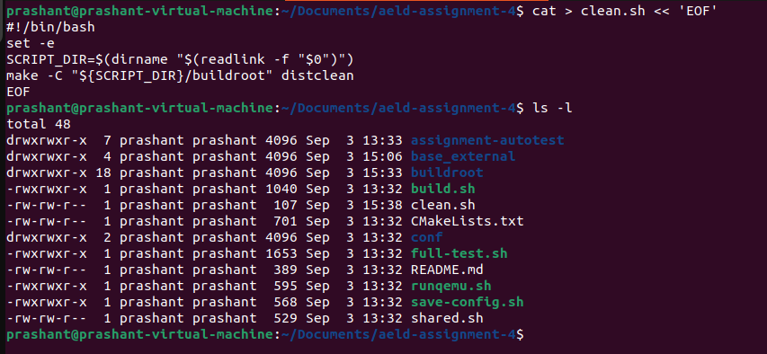

```bash
chmod +x clean.sh
git add clean.sh
git commit -m "Add clean.sh to run make distclean"
```

---

## 10. (Optional but recommended) Buildroot speedups

Both settings below should use `$HOME`-relative paths (not hardcoded absolute paths)
so they still work for graders/CI running as a different user.

In `buildroot`:

```bash
cd buildroot
make menuconfig
```

- `Build options` → `Location to save buildroot config` — n/a here; instead set:
- `Build options` → `Download dir` (`BR2_DL_DIR`) → set to `$(HOME)/.dl` (buildroot
  expands `$(HOME)` at build time; this directory survives `distclean`).
- `Build options` → `Enable compiler cache` (`BR2_CCACHE`) → `Y`. Optionally set
  `BR2_CCACHE_DIR` to `$(HOME)/.buildroot-ccache`.

```bash
cd ..
./save-config.sh
git add base_external/configs/aesd_qemu_defconfig
git commit -m "Enable ccache and external download dir for faster rebuilds"
git push origin master
```

---

## 11. Set up the SSH deploy key for GitHub Actions

Follow the course wiki page: *Setting up Github Actions*
(`https://github.com/cu-ecen-aeld/aesd-assignments/wiki/Setting-up-Github-Actions`).
In short:

1. Generate a dedicated SSH keypair (no passphrase) that can read your repo, e.g.:
   
   `https://github.com/prashantgautamofficial/aeld-assignment-3-and-later/settings/keys/new`  
   
   ```bash
   ssh-keygen -t ed25519 -f ~/.ssh/aesd_deploy_key -C "aesd-ci" -N ""
   ```

2. Add the **public** key as a Deploy Key (read access is enough) on the repo.
   
   `https://github.com/prashantgautamofficial/aeld-assignment-3-and-later/settings/keys/new` 
      
   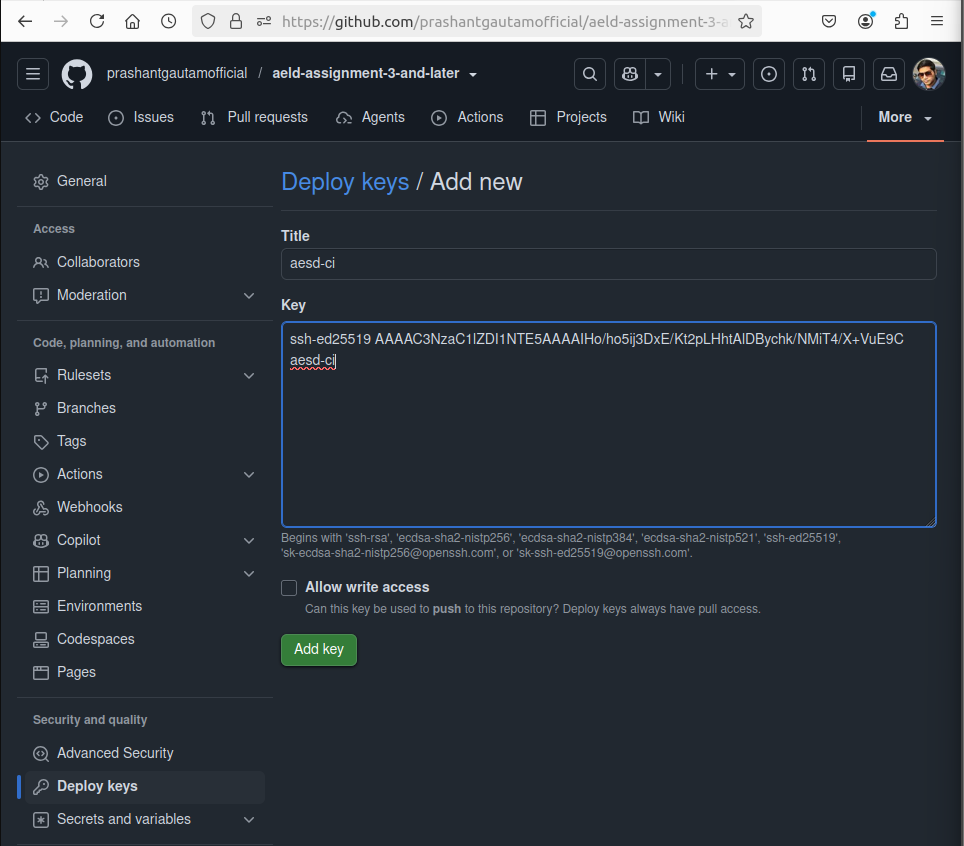

3. Add the **private** key as a repository secret.

    ```bash
    eval "$(ssh-agent -s)"
    ssh-add ~/.ssh/aesd_deploy_key
    ssh-add -l
    ```

4. Confirm your self-hosted Actions runner is registered and online for this repo, per the same wiki page.

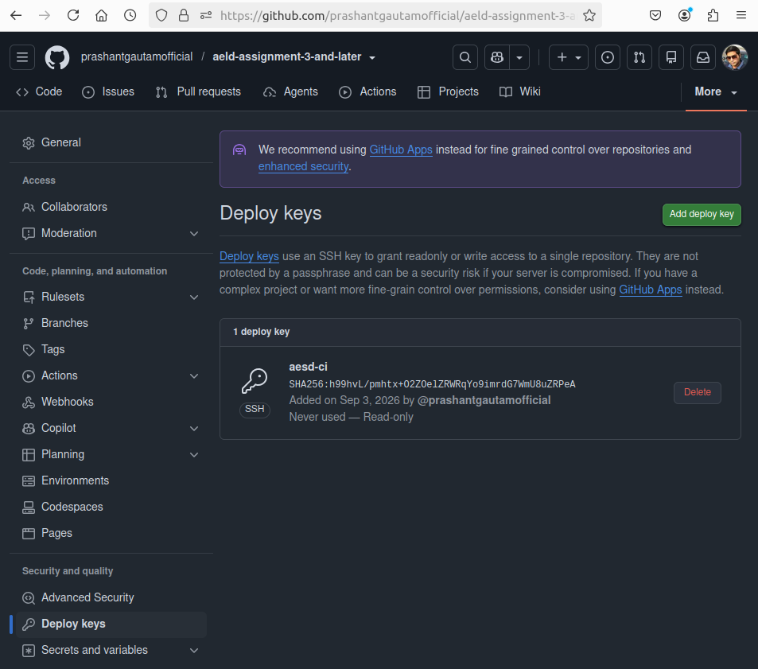

This is what makes the `git@github.com:...` SSH URL in `aesd-assignments.mk` resolvable non-interactively during CI builds.

---

## 12. Full build

Now run the real build (this will take a couple of hours the first time):

```bash
./build.sh
```

`build.sh` should detect your existing `buildroot/.config` (matching
`aesd_qemu_defconfig`) and proceed straight to `make`. Watch for the
`aesd-assignments` package section in the build log to confirm it clones your source
repo over SSH and builds `writer` with the cross `CC`.

If it fails at the `aesd-assignments` download/extract step, check:
- The SSH URL and commit hash in `aesd-assignments.mk` are correct and pushed.
- Your local SSH agent/key can clone that URL (test with `git ls-remote <url>`).
- `AESD_ASSIGNMENTS_VERSION` is a real, reachable commit (not a branch).

If it fails at build/install with `writer not found` inside QEMU later, it usually means
the Makefile didn't honor `CC` (see §6b) or the `INSTALL_TARGET_CMDS` path in the `.mk`
file doesn't match your repo's actual `finder-app/` layout.


---

## 13. Boot the image in QEMU

```bash
./runqemu.sh
```

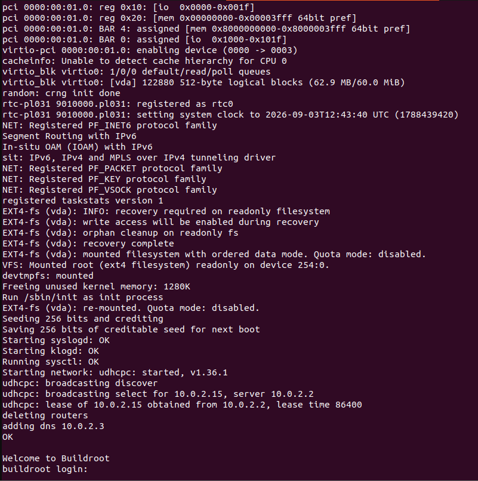

This launches `qemu-system-aarch64` using the machine model defined at
`buildroot/board/qemu/aarch64-virt/` (kernel, DTB, rootfs image paths, `-M virt`, etc.,
as shipped by the base repo). Log in as `root` (no password yet at this point unless
you've already done §14/§15).

Inside QEMU, sanity-check:

```bash
which writer finder.sh finder-test.sh
cat /etc/finder-app/conf/username.txt
cat /etc/finder-app/conf/assignment.txt
cd / && finder-test.sh
echo $?
cat /tmp/assignment4-result.txt
grep -i "root:" /var/log/messages | tail
```

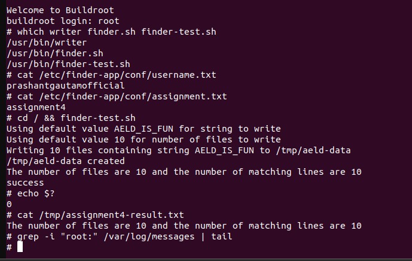

`finder-test.sh` should run successfully from any directory (proving PATH resolution
works) and `/var/log/messages` should contain the `writer` app's syslog output.

To exit QEMU: `poweroff -f` inside the guest, or `Ctrl-A` then `x` at the QEMU monitor.


---

## 14. Add dropbear (SSH server) to the image

```bash
cd buildroot
make menuconfig
```

Press `/` and search `dropbear`, or navigate `Target packages` → `Networking
applications` → `dropbear`. Enable it (`Y`), exit, save.

```bash
cd ..
./save-config.sh
```

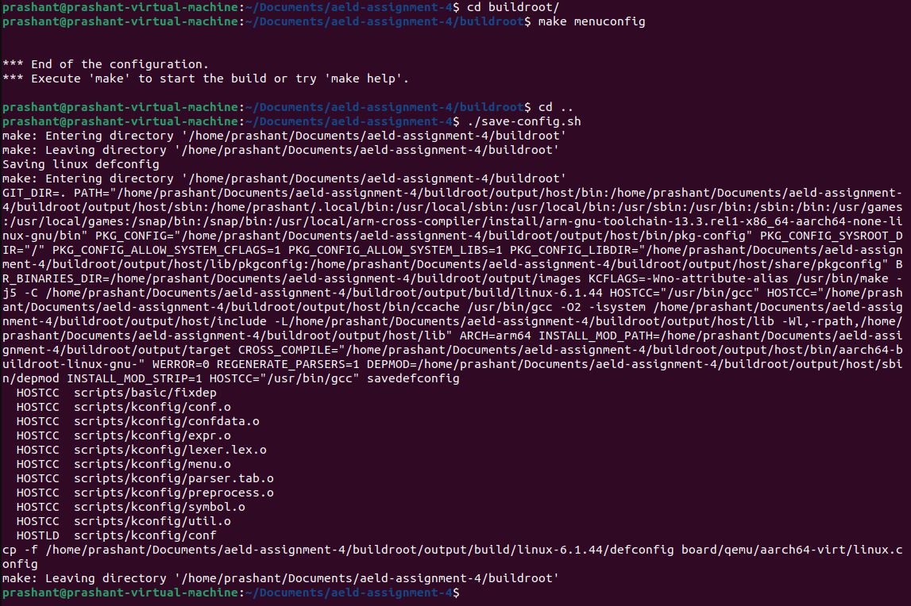


```bash
git diff base_external/configs/aesd_qemu_defconfig   # should show BR2_PACKAGE_DROPBEAR=y
```

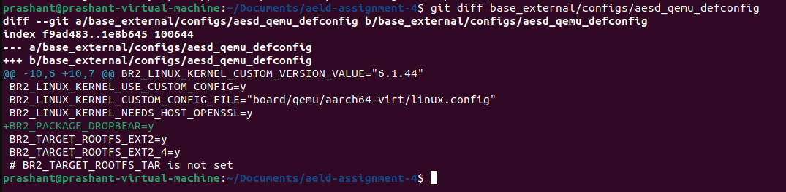

---

## 15. Set the root password

Still in `make menuconfig` (or reopen it):

`System configuration` → `Root password` → set to `root`.

This sets `BR2_TARGET_GENERIC_ROOT_PASSWD="root"` in the config. Exit, save, then:

```bash
./save-config.sh
git diff base_external/configs/aesd_qemu_defconfig
git add base_external/configs/aesd_qemu_defconfig
git commit -m "Enable dropbear SSH server and set root password"
git push origin master
```

Build with both changes included:

```bash
./build.sh
```

---

## 16. Verify SSH access

Boot the image:

```bash
./runqemu.sh
```

The base repo's QEMU network setup typically forwards host port `10022` → guest port
`22`. From another terminal on the host:

```bash
ssh -p 10022 root@localhost
# password: root
```

If host key checking gets in the way across repeated rebuilds (new host key each boot),
use:

```bash
ssh -p 10022 -o StrictHostKeyChecking=no -o UserKnownHostsFile=/dev/null root@localhost
```

---

## 17. Copy the result file back and commit it to your source repo

With QEMU still running and SSH working:

```bash
scp -P 10022 -o StrictHostKeyChecking=no -o UserKnownHostsFile=/dev/null \
  root@localhost:/tmp/assignment4-result.txt \
  /home/prashant/Documents/aeld-assignment-3-and-later/assignments/assignment4/assignment4-result.txt
```

Create the destination directory first if it doesn't exist:

```bash
mkdir -p /home/prashant/Documents/aeld-assignment-3-and-later/assignments/assignment4
```

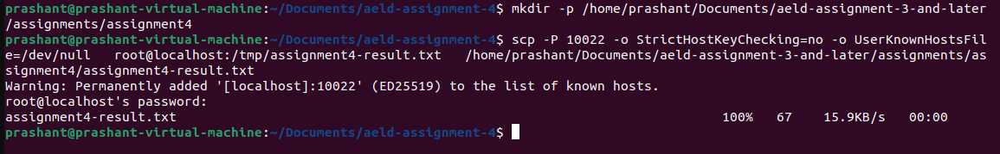

Then, in the **source** repo:

```bash
cd /home/prashant/Documents/aeld-assignment-3-and-later
git add assignments/assignment4/assignment4-result.txt
git commit -m "Assignment 4: add QEMU finder-test.sh result output"
git push origin master
```

---

## 18. Run `full-test.sh`

Back in the buildroot repo root (this typically boots QEMU headless, waits for SSH,
runs `finder-test.sh` remotely, and checks the result — confirm details against your
repo's actual script):

```bash
./full-test.sh
```

Make sure `sshpass` is installed on the host (§0) — the script needs it to log in
non-interactively as `root`/`root`.

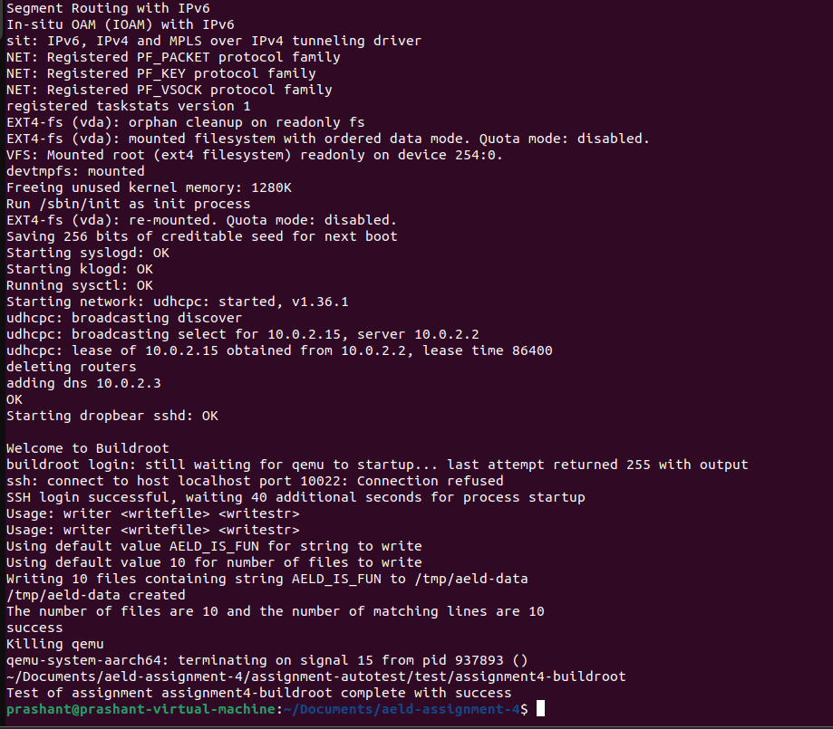

### 18.1. Edit Github actions config

```bash
cd ~/Documents/aeld-assignment-4/
cat .github/workflows/github-actions.yml
```

```yaml
name: assignment-test
on:
    push:
        tags-ignore:
            - '*'
        branches:
            - '*'
jobs:
    full-test:
        container: cuaesd/aesd-autotest:24-assignment4-buildroot
        runs-on: self-hosted
        timeout-minutes: 120
        steps:
          - uses: actions/checkout@v2
          - name: Checkout submodules
            run: git submodule update --init --recursive
          - uses: webfactory/ssh-agent@v0.5.3
            with:
                ssh-private-key: ${{ secrets.SSH_PRIVATE_KEY }}
          - name: Run full test
            env:
              GIT_SSH_COMMAND: "ssh -o StrictHostKeyChecking=no"
            run: ./full-test.sh
          - name: Cleanup
            if: always()
            run: |
              ssh-add -D
```

```bash
sed -i '/- name: Checkout submodules/i\      - name: Clean stale buildroot submodule state\n        run: |\n          if [ -d buildroot ]; then\n            cd buildroot\n            git checkout -- . || true\n            git clean -fdx || true\n            cd ..\n          fi\n          git submodule deinit -f buildroot || true' .github/workflows/github-actions.yml
```

```yaml
name: assignment-test
on:
    push:
        tags-ignore:
            - '*'
        branches:
            - '*'
jobs:
    full-test:
        container: cuaesd/aesd-autotest:24-assignment4-buildroot
        runs-on: self-hosted
        timeout-minutes: 120
        steps:
          - uses: actions/checkout@v2
          - name: Clean stale buildroot submodule state
            run: |
               if [ -d buildroot ]; then
                 cd buildroot
                 git checkout -- . || true
                 git clean -fdx || true
                 cd ..
               fi
               git submodule deinit -f buildroot || true
               rm -f .git/modules/buildroot/index.lock
          - name: Checkout submodules
            run: git submodule update --init --recursive
          - uses: webfactory/ssh-agent@v0.5.3
            with:
                ssh-private-key: ${{ secrets.SSH_PRIVATE_KEY }}
          - name: Run full test
            env:
              GIT_SSH_COMMAND: "ssh -o StrictHostKeyChecking=no"
            run: ./full-test.sh
          - name: Cleanup
            if: always()
            run: |
              ssh-add -D
```

Verify YAML code:

```python
python3 -c "import yaml; yaml.safe_load(open('.github/workflows/github-actions.yml'))" && echo "YAML OK"
```

Commit and Push

```bash
git add .github/workflows/github-actions.yml
git commit -m "ci: clean stale buildroot submodule state before checkout"

git branch          # to check the branch
git push origin master
```

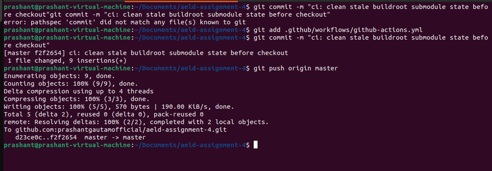


### 18.2. Add SSH_PRIVATE_KEY to Github


```bash
cd ~/Documents/aeld-assignment-4/
ls -la ~/.ssh/ | grep aesd
```

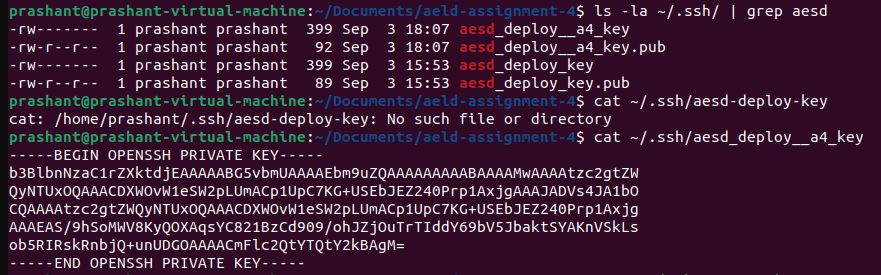

Go to:

https://github.com/prashantgautamofficial/aeld-assignment-4/settings/secrets/actions

paste the secret key obtained above with name: `SSH_PRIVATE_KEY`

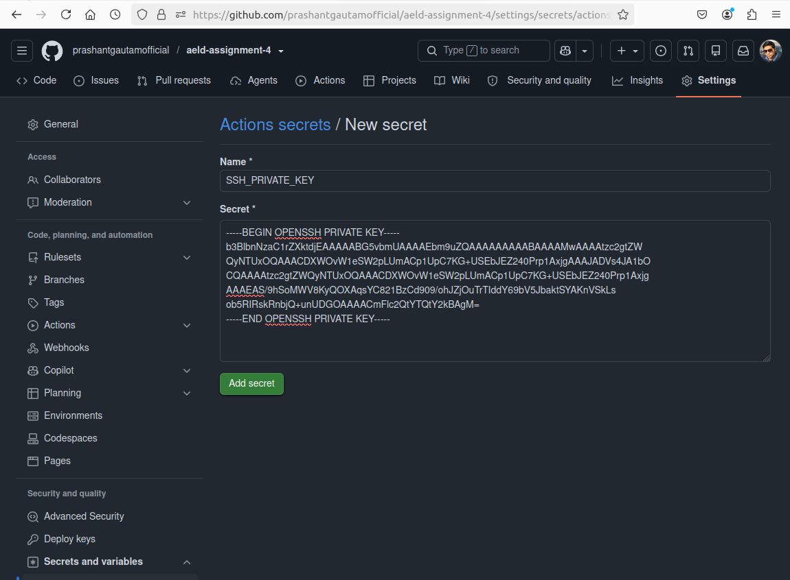

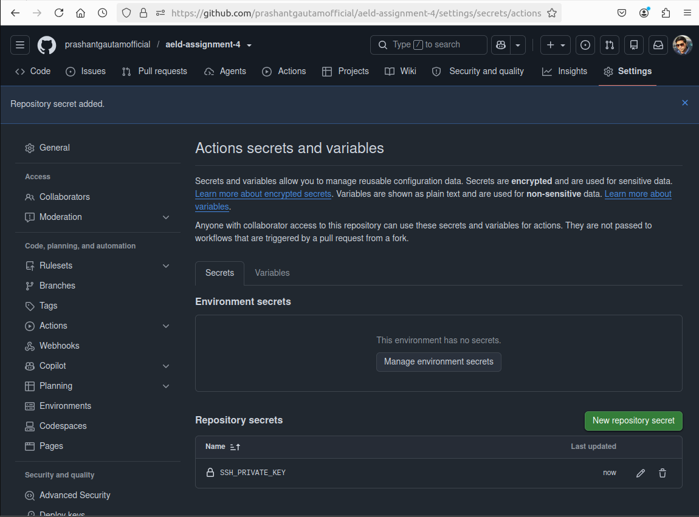


Add the **private** key as a repository secret.

```bash
eval "$(ssh-agent -s)"
ssh-add ~/.ssh/aesd_deploy__a4_key
ssh-add -l
```

[Check Github Commit URL](https://github.com/prashantgautamofficial/aeld-assignment-4/actions/runs/33862418817/job/100992350715)


## 19. Validation checklist (matches the assignment's own validation steps)

- [ ] Fresh clone → `./build.sh` (twice) → `./runqemu.sh` boots with no manual steps.
- [ ] `./clean.sh` → `./build.sh` (twice) → `./runqemu.sh` boots cleanly again.
- [ ] Inside QEMU: `finder-test.sh` (no path) runs successfully from any CWD.
- [ ] `writer` used by `finder-test.sh` is the Buildroot-cross-compiled target binary.
- [ ] `/var/log/messages` contains `writer` syslog entries.
- [ ] `ssh -p 10022 root@localhost` and `scp` both work with password `root`.
- [ ] `./full-test.sh` completes successfully (`sshpass` installed).
- [ ] `/tmp/assignment4-result.txt` content copied into
      `assignments-3-and-later-<username>/assignments/assignment4/` and pushed.

---

## 20. Tag both repositories

Once the final commits are pushed to **both** repos (Assignment 4 buildroot repo and
the assignments-3-and-later source repo):

```bash
# in each repo:
git tag -a assignment-4-complete -m "Assignment 4 complete"
git push origin assignment-4-complete
```

If a tag with that name already exists and you need to move it:

```bash
git tag -d assignment-4-complete
git push origin :refs/tags/assignment-4-complete
git tag -a assignment-4-complete -m "Assignment 4 complete"
git push origin assignment-4-complete
```

---

## Quick troubleshooting reference

| Symptom | Likely cause | Fix |
|---|---|---|
| Actions runner fails cloning `buildroot` submodule | Bad commit hash / wrong URL in `.gitmodules`, or corrupted local clone state | Re-clone fresh in a scratch dir to confirm; if runner is stuck, delete `buildroot/` under the runner's `_work` checkout and re-run `git submodule update --init --recursive` |
| `writer: not found` in QEMU | `finder-test.sh` still uses `./writer`, or app isn't installed to `/usr/bin` | Fix script to call `writer` bare (PATH), confirm `.mk` `INSTALL_TARGET_CMDS` installs to `$(TARGET_DIR)/usr/bin` |
| `writer` build fails / links wrong compiler | Makefile hardcodes `gcc` instead of honoring `CC` | Use `CC ?= $(CROSS_COMPILE)gcc` and let Buildroot pass `TARGET_CC` |
| `aesd-assignments` package can't clone source repo during CI | Using HTTPS URL, or deploy key not configured as a repo secret | Use SSH URL form; add deploy key per §11 |
| `finder-test.sh` fails unless run from a specific directory | Script still assumes it's colocated with `conf/` or the other scripts | Point config reads at `/etc/finder-app/conf`, drop relative script paths |
| Build re-downloads sources every time you `clean.sh` | `BR2_DL_DIR` unset or pointing inside `buildroot/output` | Set `BR2_DL_DIR` to `$(HOME)/.dl` in menuconfig, re-`save-config.sh` |

---

### Notes on sources used to build this guide

- Buildroot User Manual — System Requirements / mandatory & optional host packages,
  Customization (`BR2_EXTERNAL`), and Generic Package Tutorial sections
  (buildroot.org/downloads/manual/manual.html).
- `cu-ecen-aeld/aesd-autotest-docker` `docker/Dockerfile`, `assignment4-buildroot` stage,
  for the confirmed host package list used by the course's own CI image.
- `cu-ecen-aeld/buildroot-assignments-base` repo (starter scripts: `build.sh`,
  `save-config.sh`, `runqemu.sh`, `shared.sh`, `base_external/`).
- A real student submission's `SETUP_SUMMARY.md`
  (`cu-ecen-aeld/assignment-5-vsnam19`) confirming the actual directory layout
  (`base_external/package/aesd-assignments/{Config.in,aesd-assignments.mk}`,
  `external.desc` name `project_base`, install paths `/usr/bin` and
  `/etc/finder-app/conf`) and the git-SSH-site package pattern.
- Another real submission's build log (`assignment-5-ryanchallacombe`) confirming the
  `git submodule add ... buildroot && git checkout 2024.02.x` flow and its verification
  via the `CHANGES` file.
