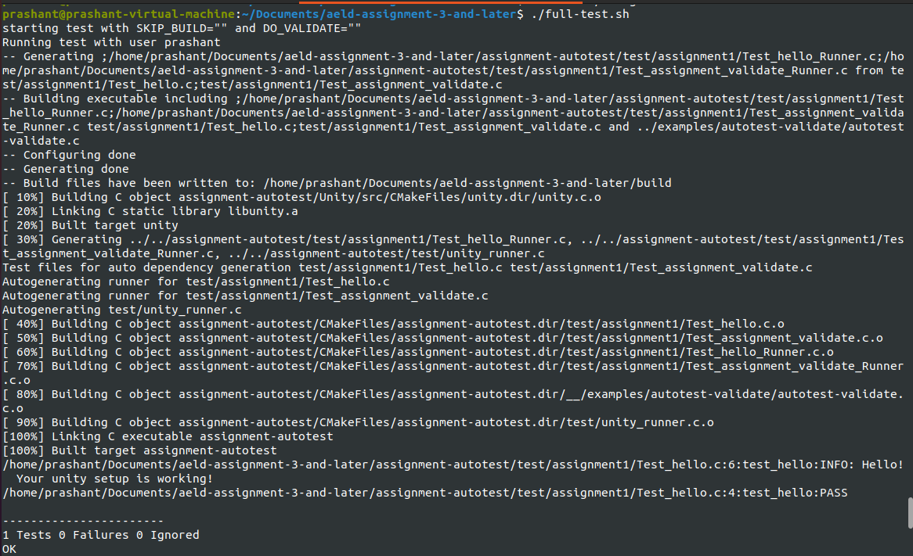
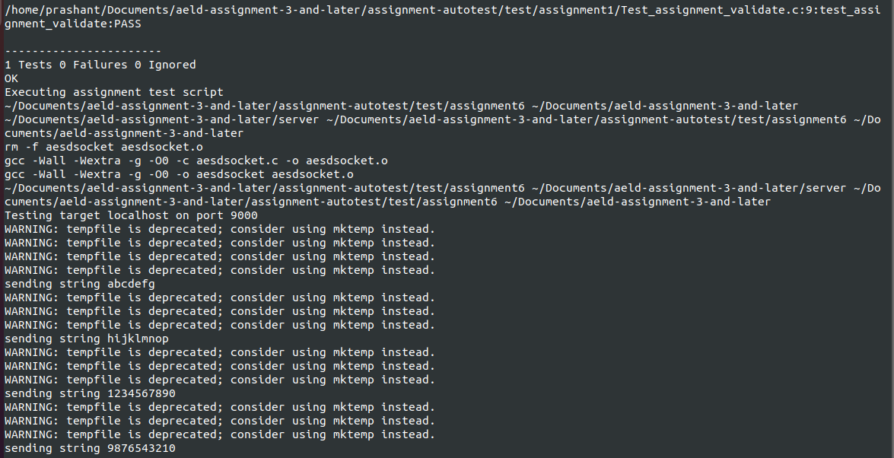
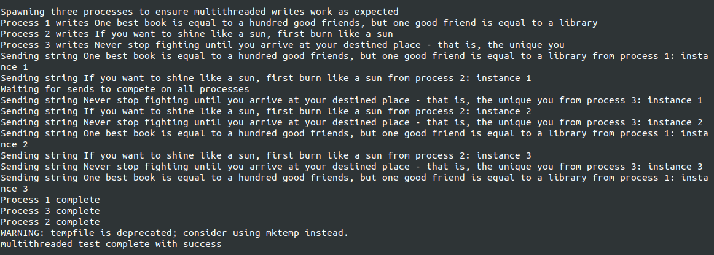
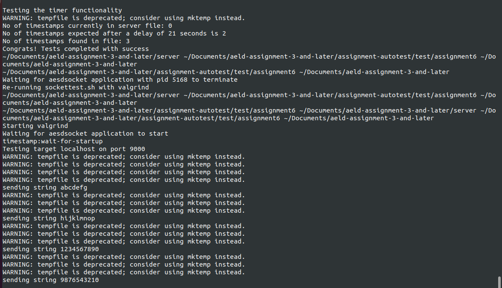
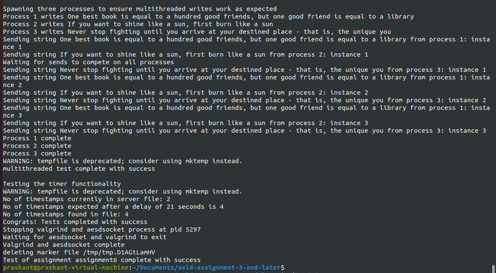

# Assignment 6 Part 1: Native Socket Server Threading Support

## STEP 1: Modify `aesdsocket.c`


```bash
cd ~/Documents/aeld-assignment-3-and-later/server
gedit aesdsocket.c
```

### Copy Paste the following Server Code

```c
/*
 * aesdsocket.c
 *
 * AESD Assignment 6 Part 1 - multithreaded stream socket server.
 *
 * Opens a stream socket on port 9000, accepts connections, and spawns one
 * thread per connection to receive newline-delimited data packets, append
 * each completed packet to /var/tmp/aesdsocketdata, and return the full
 * contents of that file back to the client after each packet is received.
 *
 * All writes to /var/tmp/aesdsocketdata (both client packet writes and the
 * periodic timestamp write) are serialized with a single mutex so packets
 * from concurrent connections are never interleaved.
 *
 * A dedicated timer thread appends an RFC 2822 timestamp line to the data
 * file every 10 seconds.
 *
 * Connection threads are tracked on a singly linked list (sys/queue.h
 * SLIST, same style as https://github.com/TaborKelly/queue-example) so the
 * main thread can pthread_join() each one - no detached threads are used.
 *
 * Supports:
 *   - Logging via syslog (LOG_USER facility)
 *   - Graceful shutdown on SIGINT/SIGTERM: stop accepting, signal every
 *     connection thread + the timer thread to exit, join them all, then
 *     remove the data file.
 *   - "-d" argument to run as a daemon (fork occurs only after successful bind)
 */

#include <stdio.h>
#include <stdlib.h>
#include <string.h>
#include <unistd.h>
#include <errno.h>
#include <signal.h>
#include <fcntl.h>
#include <syslog.h>
#include <stdbool.h>
#include <pthread.h>
#include <time.h>

#include <sys/types.h>
#include <sys/socket.h>
#include <sys/stat.h>
#include <sys/wait.h>
#include <sys/queue.h>
#include <netinet/in.h>
#include <arpa/inet.h>
#include <netdb.h>

#define PORT               "9000"
#define DATA_FILE          "/var/tmp/aesdsocketdata"
#define BACKLOG            10
#define RECV_CHUNK_SIZE    1024
#define TIMESTAMP_INTERVAL_SEC 10

/* ------------------------------------------------------------------ */
/* Globals                                                             */
/* ------------------------------------------------------------------ */

/* Set by the signal handler; polled by the main accept loop and by
 * every worker thread's inner loops. */
static volatile sig_atomic_t g_shutdown_requested = 0;

static int g_listen_fd = -1;

/* Serializes every write() to DATA_FILE, whether it originates from a
 * client packet or from the timestamp thread. */
static pthread_mutex_t g_datafile_mutex = PTHREAD_MUTEX_INITIALIZER;

/*
 * Per-connection thread bookkeeping node.
 *
 * thread_complete is set by the worker just before it returns, so the
 * main thread can opportunistically reap (join + free) finished nodes
 * on each pass through the accept loop without blocking on threads that
 * are still active.
 */
struct thread_entry
{
    pthread_t       tid;
    int             client_fd;
    bool            thread_complete;
    SLIST_ENTRY(thread_entry) entries;
};

SLIST_HEAD(thread_list_head, thread_entry);
static struct thread_list_head g_thread_list = SLIST_HEAD_INITIALIZER(g_thread_list);

/* Guards g_thread_list itself (insertion from main thread, completion
 * flag updates from worker threads, removal from main thread). */
static pthread_mutex_t g_thread_list_mutex = PTHREAD_MUTEX_INITIALIZER;

static pthread_t g_timer_tid;
static bool      g_timer_thread_started = false;

/* ------------------------------------------------------------------ */
/* Signal handling                                                     */
/* ------------------------------------------------------------------ */

static void signal_handler(int signo)
{
    (void)signo;
    g_shutdown_requested = 1;

    /*
     * Unblock the main thread's accept() immediately. Per-connection
     * client sockets are shut down individually below once we hold the
     * thread list mutex would not be async-signal-safe, so instead each
     * worker thread notices g_shutdown_requested on its own via a
     * bounded-timeout recv() (see handle_client) and exits promptly.
     */
    if (g_listen_fd != -1)
    {
        shutdown(g_listen_fd, SHUT_RDWR);
    }
}

static int setup_signal_handlers(void)
{
    struct sigaction sa;
    memset(&sa, 0, sizeof(sa));
    sa.sa_handler = signal_handler;
    sigemptyset(&sa.sa_mask);
    sa.sa_flags = 0; /* no SA_RESTART: we want blocking calls to return EINTR */

    if (sigaction(SIGINT, &sa, NULL) == -1)
    {
        syslog(LOG_ERR, "sigaction(SIGINT) failed: %s", strerror(errno));
        return -1;
    }
    if (sigaction(SIGTERM, &sa, NULL) == -1)
    {
        syslog(LOG_ERR, "sigaction(SIGTERM) failed: %s", strerror(errno));
        return -1;
    }
    return 0;
}

/* ------------------------------------------------------------------ */
/* Listening socket setup                                              */
/* ------------------------------------------------------------------ */

static int create_and_bind_listen_socket(void)
{
    struct addrinfo hints, *res, *rp;
    int sockfd = -1;
    int yes = 1;
    int rv;

    memset(&hints, 0, sizeof(hints));
    hints.ai_family = AF_UNSPEC;
    hints.ai_socktype = SOCK_STREAM;
    hints.ai_flags = AI_PASSIVE;

    rv = getaddrinfo(NULL, PORT, &hints, &res);
    if (rv != 0)
    {
        syslog(LOG_ERR, "getaddrinfo failed: %s", gai_strerror(rv));
        return -1;
    }

    for (rp = res; rp != NULL; rp = rp->ai_next)
    {
        sockfd = socket(rp->ai_family, rp->ai_socktype, rp->ai_protocol);
        if (sockfd == -1)
        {
            continue;
        }

        if (setsockopt(sockfd, SOL_SOCKET, SO_REUSEADDR, &yes, sizeof(yes)) == -1)
        {
            syslog(LOG_ERR, "setsockopt failed: %s", strerror(errno));
            close(sockfd);
            sockfd = -1;
            continue;
        }

        if (bind(sockfd, rp->ai_addr, rp->ai_addrlen) == -1)
        {
            close(sockfd);
            sockfd = -1;
            continue;
        }

        break; /* success */
    }

    freeaddrinfo(res);

    if (sockfd == -1)
    {
        syslog(LOG_ERR, "Failed to bind socket on port %s: %s", PORT, strerror(errno));
        return -1;
    }

    if (listen(sockfd, BACKLOG) == -1)
    {
        syslog(LOG_ERR, "listen failed: %s", strerror(errno));
        close(sockfd);
        return -1;
    }

    return sockfd;
}

/* ------------------------------------------------------------------ */
/* Data file helpers (all callers must already understand these take   */
/* g_datafile_mutex internally)                                        */
/* ------------------------------------------------------------------ */

/*
 * Appends [data, data+len) to DATA_FILE under g_datafile_mutex.
 * Returns 0 on success, -1 on failure.
 */
static int append_to_datafile_locked(const char *data, size_t len)
{
    int rc = 0;

    pthread_mutex_lock(&g_datafile_mutex);

    int fd = open(DATA_FILE, O_WRONLY | O_CREAT | O_APPEND, 0644);
    if (fd == -1)
    {
        syslog(LOG_ERR, "open(%s) failed: %s", DATA_FILE, strerror(errno));
        pthread_mutex_unlock(&g_datafile_mutex);
        return -1;
    }

    size_t written = 0;
    while (written < len)
    {
        ssize_t w = write(fd, data + written, len - written);
        if (w == -1)
        {
            if (errno == EINTR)
            {
                continue;
            }
            syslog(LOG_ERR, "write(%s) failed: %s", DATA_FILE, strerror(errno));
            rc = -1;
            break;
        }
        written += (size_t)w;
    }

    close(fd);
    pthread_mutex_unlock(&g_datafile_mutex);
    return rc;
}

/*
 * Sends the full current contents of DATA_FILE to client_fd.
 *
 * We still take g_datafile_mutex here: without it, a concurrent writer
 * (another connection's packet, or the timestamp thread) could interleave
 * a partial append while we're mid-read, since a plain read() gives no
 * atomicity guarantee across the two operations. Holding the same mutex
 * used for writes means "read back current file" and "append a packet"
 * are mutually exclusive, matching what the assignment asks for.
 *
 * Returns 0 on success, -1 on failure.
 */
static int send_datafile_contents_locked(int client_fd)
{
    int rc = 0;

    pthread_mutex_lock(&g_datafile_mutex);

    int fd = open(DATA_FILE, O_RDONLY);
    if (fd == -1)
    {
        if (errno == ENOENT)
        {
            /* Nothing written yet; nothing to send. */
            pthread_mutex_unlock(&g_datafile_mutex);
            return 0;
        }
        syslog(LOG_ERR, "open(%s) for read failed: %s", DATA_FILE, strerror(errno));
        pthread_mutex_unlock(&g_datafile_mutex);
        return -1;
    }

    char sendbuf[RECV_CHUNK_SIZE];
    ssize_t r;
    while ((r = read(fd, sendbuf, sizeof(sendbuf))) > 0)
    {
        ssize_t sent_total = 0;
        while (sent_total < r)
        {
            ssize_t s = send(client_fd, sendbuf + sent_total, (size_t)(r - sent_total), 0);
            if (s == -1)
            {
                if (errno == EINTR)
                {
                    continue;
                }
                syslog(LOG_ERR, "send failed: %s", strerror(errno));
                rc = -1;
                goto out;
            }
            sent_total += s;
        }
    }
    if (r == -1)
    {
        syslog(LOG_ERR, "read(%s) failed: %s", DATA_FILE, strerror(errno));
        rc = -1;
    }

out:
    close(fd);
    pthread_mutex_unlock(&g_datafile_mutex);
    return rc;
}

/* ------------------------------------------------------------------ */
/* Per-connection worker thread                                        */
/* ------------------------------------------------------------------ */

/*
 * Receives a full connection's worth of newline-delimited packets from
 * client_fd, appending each completed packet to DATA_FILE and writing the
 * full file content back to the client immediately after each packet.
 *
 * Returns 0 on normal connection close or requested shutdown, -1 on
 * fatal error.
 */
static int handle_client(int client_fd)
{
    char *buf = NULL;
    size_t buf_cap = 0;
    size_t buf_len = 0;
    char chunk[RECV_CHUNK_SIZE];
    ssize_t nread;

    /*
     * Use a receive timeout so a connection thread doesn't block forever
     * in recv() past a shutdown request - the assignment requires the
     * main thread to be able to request an exit from each thread and
     * then wait for completion, so every blocking call in a worker needs
     * a bounded wait that re-checks g_shutdown_requested.
     */
    struct timeval tv = { .tv_sec = 1, .tv_usec = 0 };
    setsockopt(client_fd, SOL_SOCKET, SO_RCVTIMEO, &tv, sizeof(tv));

    for (;;)
    {
        if (g_shutdown_requested)
        {
            free(buf);
            return 0;
        }

        nread = recv(client_fd, chunk, sizeof(chunk), 0);

        if (nread == 0)
        {
            /* Client closed connection */
            break;
        }
        if (nread == -1)
        {
            if (errno == EAGAIN || errno == EWOULDBLOCK)
            {
                /* Recv timeout expired; loop back and re-check shutdown flag. */
                continue;
            }
            if (errno == EINTR)
            {
                continue;
            }
            syslog(LOG_ERR, "recv failed: %s", strerror(errno));
            free(buf);
            return -1;
        }

        /* Grow the accumulation buffer to fit the new chunk */
        {
            size_t needed = buf_len + (size_t)nread;
            if (needed > buf_cap)
            {
                size_t new_cap = buf_cap == 0 ? RECV_CHUNK_SIZE : buf_cap;
                while (new_cap < needed)
                {
                    new_cap *= 2;
                }
                char *tmp = realloc(buf, new_cap);
                if (tmp == NULL)
                {
                    syslog(LOG_ERR, "malloc/realloc failed while buffering packet, discarding");
                    free(buf);
                    buf = NULL;
                    buf_cap = 0;
                    buf_len = 0;
                    continue;
                }
                buf = tmp;
                buf_cap = new_cap;
            }
        }

        memcpy(buf + buf_len, chunk, (size_t)nread);
        buf_len += (size_t)nread;

        /* Process as many complete (newline-terminated) packets as we have */
        for (;;)
        {
            char *nl = memchr(buf, '\n', buf_len);
            if (nl == NULL)
            {
                break;
            }

            size_t packet_len = (size_t)(nl - buf) + 1; /* include the newline */

            if (append_to_datafile_locked(buf, packet_len) == -1)
            {
                free(buf);
                return -1;
            }

            if (send_datafile_contents_locked(client_fd) == -1)
            {
                free(buf);
                return -1;
            }

            /* Remove the processed packet from the front of buf */
            size_t remaining = buf_len - packet_len;
            memmove(buf, buf + packet_len, remaining);
            buf_len = remaining;
        }
    }

    free(buf);
    return 0;
}

/*
 * Thread entry point for a single accepted connection.
 * arg is the struct thread_entry * allocated by the accept loop.
 */
static void *connection_thread_func(void *arg)
{
    struct thread_entry *entry = (struct thread_entry *)arg;

    char ip_str[INET6_ADDRSTRLEN] = {0};
    /* Best-effort peer address for logging; failures here are non-fatal. */
    {
        struct sockaddr_storage peer;
        socklen_t plen = sizeof(peer);
        if (getpeername(entry->client_fd, (struct sockaddr *)&peer, &plen) == 0)
        {
            if (peer.ss_family == AF_INET)
            {
                struct sockaddr_in *s = (struct sockaddr_in *)&peer;
                inet_ntop(AF_INET, &s->sin_addr, ip_str, sizeof(ip_str));
            }
            else if (peer.ss_family == AF_INET6)
            {
                struct sockaddr_in6 *s = (struct sockaddr_in6 *)&peer;
                inet_ntop(AF_INET6, &s->sin6_addr, ip_str, sizeof(ip_str));
            }
        }
        if (ip_str[0] == '\0')
        {
            strncpy(ip_str, "unknown", sizeof(ip_str) - 1);
        }
    }

    syslog(LOG_INFO, "Accepted connection from %s", ip_str);

    handle_client(entry->client_fd);

    syslog(LOG_INFO, "Closed connection from %s", ip_str);

    close(entry->client_fd);
    entry->client_fd = -1;

    /* Mark complete under the list mutex; main thread reaps/joins it. */
    pthread_mutex_lock(&g_thread_list_mutex);
    entry->thread_complete = true;
    pthread_mutex_unlock(&g_thread_list_mutex);

    return NULL;
}

/* ------------------------------------------------------------------ */
/* Timestamp thread                                                    */
/* ------------------------------------------------------------------ */

/*
 * Every TIMESTAMP_INTERVAL_SEC seconds, appends:
 *   timestamp:<RFC 2822 formatted time>\n
 * to DATA_FILE under g_datafile_mutex (via append_to_datafile_locked,
 * the same helper the connection threads use), so a timestamp write can
 * never be interleaved with a client packet write.
 *
 * Sleeps in small slices so it notices g_shutdown_requested promptly
 * instead of sleeping the full 10 seconds after a shutdown request.
 */
static void *timer_thread_func(void *arg)
{
    (void)arg;

    while (!g_shutdown_requested)
    {
        for (int slept = 0; slept < TIMESTAMP_INTERVAL_SEC && !g_shutdown_requested; slept++)
        {
            sleep(1);
        }

        if (g_shutdown_requested)
        {
            break;
        }

        time_t now = time(NULL);
        struct tm tm_now;
        if (localtime_r(&now, &tm_now) == NULL)
        {
            syslog(LOG_ERR, "localtime_r failed: %s", strerror(errno));
            continue;
        }

        char timebuf[128];
        /* RFC 2822 compliant strftime format, per assignment spec */
        size_t n = strftime(timebuf, sizeof(timebuf), "%a, %d %b %Y %H:%M:%S %z", &tm_now);
        if (n == 0)
        {
            syslog(LOG_ERR, "strftime produced empty output");
            continue;
        }

        char line[160];
        int written = snprintf(line, sizeof(line), "timestamp:%s\n", timebuf);
        if (written < 0)
        {
            syslog(LOG_ERR, "snprintf failed formatting timestamp line");
            continue;
        }

        (void)append_to_datafile_locked(line, (size_t)written);
    }

    return NULL;
}

/* ------------------------------------------------------------------ */
/* Thread list management                                              */
/* ------------------------------------------------------------------ */

/*
 * Walks g_thread_list once, joining and freeing any entry whose worker
 * has finished (thread_complete == true). Non-blocking with respect to
 * threads still running. Called opportunistically from the accept loop
 * so the list doesn't grow unbounded across a long-running server.
 */
static void reap_completed_threads(void)
{
    bool found_one;

    do
    {
        found_one = false;
        struct thread_entry *entry;
        struct thread_entry *to_join = NULL;

        pthread_mutex_lock(&g_thread_list_mutex);
        SLIST_FOREACH(entry, &g_thread_list, entries)
        {
            if (entry->thread_complete)
            {
                to_join = entry;
                found_one = true;
                break;
            }
        }
        if (to_join != NULL)
        {
            SLIST_REMOVE(&g_thread_list, to_join, thread_entry, entries);
        }
        pthread_mutex_unlock(&g_thread_list_mutex);

        if (to_join != NULL)
        {
            pthread_join(to_join->tid, NULL);
            free(to_join);
        }
    } while (found_one);
}

/*
 * Shutdown path: close every still-open client socket so each worker's
 * recv() unblocks (in addition to the SO_RCVTIMEO poll loop), then join
 * every remaining thread and free its node.
 */
static void join_all_threads_and_cleanup(void)
{
    pthread_mutex_lock(&g_thread_list_mutex);
    struct thread_entry *entry;
    SLIST_FOREACH(entry, &g_thread_list, entries)
    {
        if (entry->client_fd != -1)
        {
            shutdown(entry->client_fd, SHUT_RDWR);
        }
    }
    pthread_mutex_unlock(&g_thread_list_mutex);

    /* Now join everyone; list is only ever mutated by the main thread
     * from here on, so no lock is needed for the drain itself. */
    while (!SLIST_EMPTY(&g_thread_list))
    {
        entry = SLIST_FIRST(&g_thread_list);
        SLIST_REMOVE_HEAD(&g_thread_list, entries);
        pthread_join(entry->tid, NULL);
        if (entry->client_fd != -1)
        {
            close(entry->client_fd);
        }
        free(entry);
    }
}

/* ------------------------------------------------------------------ */
/* Daemonizing                                                         */
/* ------------------------------------------------------------------ */

static int daemonize(void)
{
    pid_t pid = fork();

    if (pid == -1)
    {
        syslog(LOG_ERR, "fork failed while daemonizing: %s", strerror(errno));
        return -1;
    }
    if (pid > 0)
    {
        /* Parent exits, letting the child continue as the daemon */
        exit(EXIT_SUCCESS);
    }

    /* Child continues here */
    if (setsid() == -1)
    {
        syslog(LOG_ERR, "setsid failed: %s", strerror(errno));
        return -1;
    }

    if (chdir("/") == -1)
    {
        syslog(LOG_ERR, "chdir(/) failed: %s", strerror(errno));
        return -1;
    }

    /* Redirect standard fds to /dev/null */
    int devnull = open("/dev/null", O_RDWR);
    if (devnull != -1)
    {
        dup2(devnull, STDIN_FILENO);
        dup2(devnull, STDOUT_FILENO);
        dup2(devnull, STDERR_FILENO);
        if (devnull > STDERR_FILENO)
        {
            close(devnull);
        }
    }

    return 0;
}

/* ------------------------------------------------------------------ */
/* main                                                                 */
/* ------------------------------------------------------------------ */

int main(int argc, char *argv[])
{
    bool run_as_daemon = false;

    if (argc > 1 && strcmp(argv[1], "-d") == 0)
    {
        run_as_daemon = true;
    }

    openlog("aesdsocket", LOG_PID, LOG_USER);

    if (setup_signal_handlers() == -1)
    {
        closelog();
        return -1;
    }

    g_listen_fd = create_and_bind_listen_socket();
    if (g_listen_fd == -1)
    {
        closelog();
        return -1;
    }

    if (run_as_daemon)
    {
        /*
         * Fork happens only after a successful bind, per assignment
         * requirement. The timer thread is started below, after this
         * point, so it always starts inside the process that will
         * actually run as the daemon (the child) - never in the parent,
         * which exits immediately inside daemonize().
         */
        if (daemonize() == -1)
        {
            close(g_listen_fd);
            closelog();
            return -1;
        }
    }

    /* Start the timestamp thread once we're in the final long-running
     * process (post-fork if daemonizing). */
    if (pthread_create(&g_timer_tid, NULL, timer_thread_func, NULL) != 0)
    {
        syslog(LOG_ERR, "pthread_create for timer thread failed: %s", strerror(errno));
        close(g_listen_fd);
        closelog();
        return -1;
    }
    g_timer_thread_started = true;

    while (!g_shutdown_requested)
    {
        struct sockaddr_storage client_addr;
        socklen_t addr_len = sizeof(client_addr);

        int client_fd = accept(g_listen_fd, (struct sockaddr *)&client_addr, &addr_len);
        if (client_fd == -1)
        {
            if (errno == EINTR || g_shutdown_requested)
            {
                break;
            }
            syslog(LOG_ERR, "accept failed: %s", strerror(errno));
            reap_completed_threads();
            continue;
        }

        struct thread_entry *entry = malloc(sizeof(struct thread_entry));
        if (entry == NULL)
        {
            syslog(LOG_ERR, "malloc failed for thread_entry, dropping connection");
            close(client_fd);
            reap_completed_threads();
            continue;
        }
        entry->client_fd = client_fd;
        entry->thread_complete = false;

        if (pthread_create(&entry->tid, NULL, connection_thread_func, entry) != 0)
        {
            syslog(LOG_ERR, "pthread_create failed: %s", strerror(errno));
            close(client_fd);
            free(entry);
            reap_completed_threads();
            continue;
        }

        pthread_mutex_lock(&g_thread_list_mutex);
        SLIST_INSERT_HEAD(&g_thread_list, entry, entries);
        pthread_mutex_unlock(&g_thread_list_mutex);

        /* Opportunistically reap threads that finished since the last
         * time around the loop, so long-running servers don't leak
         * thread_entry nodes for short-lived connections. */
        reap_completed_threads();
    }

    syslog(LOG_INFO, "Caught signal, exiting");

    if (g_listen_fd != -1)
    {
        close(g_listen_fd);
        g_listen_fd = -1;
    }

    /* Request exit from every connection thread and wait for them all
     * to complete before proceeding, per assignment requirement. */
    join_all_threads_and_cleanup();

    /* Timer thread also watches g_shutdown_requested; join it last. */
    if (g_timer_thread_started)
    {
        pthread_join(g_timer_tid, NULL);
    }

    if (remove(DATA_FILE) == -1 && errno != ENOENT)
    {
        syslog(LOG_ERR, "Failed to remove %s: %s", DATA_FILE, strerror(errno));
    }

    pthread_mutex_destroy(&g_datafile_mutex);
    pthread_mutex_destroy(&g_thread_list_mutex);

    closelog();
    return 0;
}
```


## STEP 2: Modify assignment config to enable `assignment6` tests

```bash
cd ~/Documents/aeld-assignment-3-and-later/conf

cat > assignment.txt << 'EOF'
assignment6
EOF
```


## STEP 3: Make and Run the server app


```bash
cd ~/Documents/aeld-assignment-3-and-later/server
make clean
make
./aesdsocket
```


## STEP 4: Run `sockettest.sh`

```bash
cd ~/Documents/aeld-assignment-3-and-later/assignment-autotest/test/assignment6
./sockettest.sh
```

## STEP 4: Run `full-test.sh`

```bash
cd ~/Documents/aeld-assignment-3-and-later/
./full-test.sh
```





